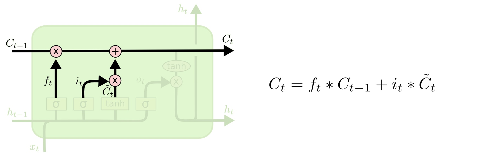
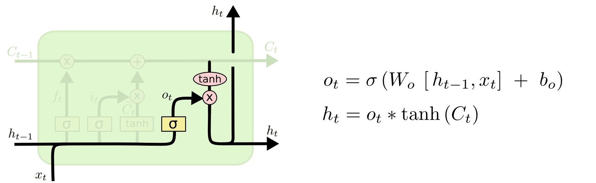

## 优化器Optim
优化即为寻找最小loss的过程，通常采用梯度下降的算法，关于移动的方向在深度学习里基本上是沿着梯度的方向，但是对于移动的距离，会有不同的解法，朝着所有样本的梯度方向移动是数学里梯度下降法的做法，但是不适合深度学习。

SGD：朝着当前批次的梯度方向移动
$$
\theta_t = \theta_{t-1} - \eta g_{t-1}
$$
SGDM：朝着当前批次批次和上一次批次的联合梯度方向移动
$$
v = - \eta g_{t-1} 
$$
$$
\theta_t = \theta_{t-1} + v_t + m v_{t-1}
$$
Adagrad：朝着当前批次的梯度方向移动，但是大小要考虑过去的梯度均方值
$$
\theta_t = \theta_{t-1} - \frac{\eta}{\sqrt{\sum_{i=0}^{t-1} g_i^2 }} g_{t-1}
$$
RMSPro：朝着当前批次的梯度方向移动，但是大小要考虑过去的梯度均方值递减

$$
v_1 = g_0
$$
$$
v_t =\alpha v_{t-1} + (1- \alpha) g_{t-1}^2
$$
$$
\theta_t = \theta_{t-1} - \frac{\eta}{\sqrt{v_t}} g_{t-1}
$$

（和Adagrad比较更好，因为过去的梯度会累积到很大，会导致后面梯度非常小）

Adam：SGDM + RMSPro


Tacotron\Bert\Transformer\Big-gan\MEMO：Adam
YOLO\Mask RNN\Resnet\Mask RNN：SGDM

比较：Adam和SGDM
Adam：训练较快，但是泛化性不好
SGDM：训练较慢，但是泛化性好

SWATS：Adam->SGDM

解决Adam问题：
（1）小的梯度累积会影响突然出现的大梯度：很有可能只有少部分批次会提供大的梯度，但是大的梯度在小的梯度累积下只会走很小的距离
AMSGrad

AdaBound

提升SGDM：


### 

### CNN
卷积神经网络的成功之处在与卷积和池化

卷积可以认为是简化了的全连接层

（1）没有偏差

（2）参数共享

多个输出的卷积可以认为是识别不同特征的通道

池化在于可以通过全局的视角搜寻特征

#### 卷积
首先你明白卷积多基本含义，然后理解卷积不仅仅是在通道内卷积，而且是是跨越多通道的


#### 池化
池化只是在通道内池化，并不跨越不同通道

最大池化、平均池化、注意力池化
### RNN
标准神经网络中的所有输入和输出都是相互独立的，但是在某些情况下，例如在预测短语的下一个单词时，前面的单词是必要的，因此必须记住前面的单词。结果，RNN 应运而生，它使用隐藏层来克服这个问题。RNN 最重要的组成部分是隐藏状态，它记住有关序列的特定信息。

RNN 有一个内存，用于存储有关计算的所有信息。它对每个输入采用相同的设置，因为它通过在所有输入或隐藏层上执行相同的任务来产生相同的结果。

RNN通常会用来一对多、多对多、多对一对任务。
#### [Simple RNN](https://www.analyticsvidhya.com/blog/2022/03/a-brief-overview-of-recurrent-neural-networks-rnn/)
本节点的输出同时取决于当前的输入和隐藏状态。


ElmanRNN将上一次的隐藏层状态作为下一次的隐藏状态，JordanRNN将上一次的输出作为下一次的隐藏状态,下面以Elman为例说明隐藏状态如何起作用


这样的RNN会面临两个问题：

（1）梯度消失：LSTM可以解决梯度消失的问题（记忆不会因为一次输出为0就被洗掉）

（2）梯度爆炸：因为某一个状态可能累计在隐藏状态中导致不断累积，可以通过Clipping解决


#### LSTM
LSTM的核心就是记忆单元和输入门、输出门、遗忘门，主要步骤如下：

（1）记忆单元遗忘：


（2）记忆如何更新：



（3）记忆如何输出：



#### GRU
GRU只有重置门、更新门，没有隐藏记忆单元，会生成隐藏状态


（1）产生候选隐藏状态：


（2）输出当前隐藏状态


#### Bidrectional RNN

#### 拓展
Sequence to Sequence AutoDecoder

#### Pytorch 关于RNN的函数
Pytorch中关于RNN的函数有下面四个，其中nn.RNNBase只是三者共同的祖先，没有forward函数
```
nn.RNNBase
nn.RNN
nn.LSTM
nn.GRU
```

### Transformer

`Transformer`完全是基于`Attention`和`Seq to Seq`的模型,论文原文如下[Attention Is All You Need](https://arxiv.org/abs/1706.03762),有关`Transformer`的讲解我不再重复造轮子，请参考[Transformer精讲](https://adaning.github.io/posts/6744.html)，[The Illustrated Transformer](https://jalammar.github.io/illustrated-transformer/)


## 参考资料
动手学深度学习v2
李宏毅ML2023


