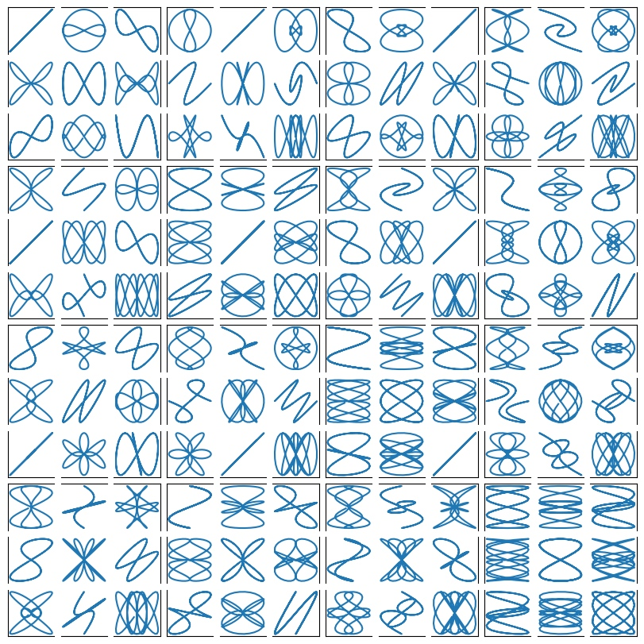

# 从零开始学Matplotlib绘图

Matplotlib是绘制图片的利器,支持多种类型的绘制样式,甚至还可以绘制动画,快和我一起来学习吧,本文[参考](https://matplotlib.org/stable/users/explain/quick_start.html#quick-start)

## 你好世界
下面是第一个实例
```
import numpy as np
import matplotlib.pyplot as plt
x = np.random.random(10)
fig = plt.figure()
ax = fig.add_axes(rect = [0,0,1,1])
ax.plot(x)
ax.set_title("Hello world!")
plt.show()
```


这段实例的主要任务如下
- 创建一个画布Figure:plt.figure
- 添加一个画区Axes:fig.add_axes,[左,下,宽,高]=[0,0,1,1]
- 添加一个画件Artist-Line2D:ax.plot
- 添加一个画件Artist-Text:ax.set_title
- 展示绘制图形:plt.show


## 无限可分

使用figure画图的最重要的功能之一是绘制多个图形在一个画布上,你可以通过下面的函数绘制
### fig.subfigures()

`fig.subfigures`的参数如下
- `nrows, ncols` : `int`,指定划分子图的网格行列数
- `wspace, hspace` : `float`, 指定子图的水平间距和垂直间距
- `width_ratios` : `array-like of length *ncols`,指定子图的宽度比,数组长度等同与列数
- `height_ratios` : `array-like of length *nrows`,指定子图的高度比,数组长度等同与行数

实例如下,你可以看到的确划分成功了,但是不同画区的显示好像重叠了诶？
```
import numpy as np
import matplotlib.pyplot as plt
fig = plt.figure()
sub_figs = fig.subfigures(2,3,wspace=0.1,hspace=0.2,width_ratios=[0.1,0.6,0.1],height_ratios=[0.5,0.5])
for i in sub_figs:
    for j in i:
        j.add_axes([0,0,0.8,0.8,])
plt.show()
```


我们在划分子区的时候的确将不同子区对应到了不重叠的子画布上,但是子区默认的[左,下,宽,高]=[0,0,0.8,0.8],左和底的开始位置恰好位于边界,自动在当前添加的刻度会超出边界被下一个子图覆盖,修改为这样就好了
```
j.add_axes([0.2,0.2,0.8,0.8,])
```
另一个方法是使用自动布局,`layout`支持`constrained`、`compressed`、`tight`三种布局,它会帮我们自动的调整被覆盖的位置
```
fig = plt.figure(layout = "constrained")
```

### fig.add_axes()
`fig.add_axes`的参数如下,较为简单不做演示

- `rect`:(left,bottom,width,height),表示新 Axes 的尺寸。所有值都是相对于图形宽度和高度的分数。

- `projection`:`str`,投影类型的名称,用于指定 Axes 的投影方式。可以是预定义的投影类型,如 'aitoff'、'hammer'、'lambert'、'mollweide'、'polar'、'rectilinear',也可以是自定义投影的名称。默认值为 None,表示使用默认的 'rectilinear' 投影。

- `polar`:`bool`,表示是否使用极坐标投影。如果设置为`True`,则等效于 projection='polar'。

- `axes_class`:`matplotlib.axes.Axes `的子类类型,用于实例化新的 `Axes` 对象。该参数与 projection 和 polar 不兼容。可以使用此参数创建自定义的 Axes 子类对象。有关示例,请参阅 :`ref:axisartist_users-guide-index`。

- `sharex、sharey`:`matplotlib.axes.Axes` 对象,用于共享 `x` 轴或 `y` 轴。共享轴将具有与共享轴的原始轴相同的限制、刻度和刻度尺度。
### fig.add_subplot()
`fig.subplot`具有的参数如下
- `nrows`, `ncols`,`projection`,`polar`,`sharex`,`sharey`,`label`:见上
- `*args`:`(row, col, *index*)`或者 `.SubplotSpec`, 默认为 `(1, 1, 1)`,按照指定的行列划分在指定序号的位置创建`Axes`，`.SubplotSpec`见下`fig.add_gridspec()`
### fig.subplots()
`fig.subplots`具有的参数如下,实际上该函数就是调用的fig.add_subplot
- `nrows`, `ncols`,`sharex`,`sharey`
- `width_ratios`,`height_ratios`:`list of array`,长度和行列对齐,指定宽度和长度比
- `squeeze`:`bool`控制返回的 `Axes` 对象的维度,指定后返回一个压缩一维数组(2,3)->(6)
- `subplot_kw`:`dict`,传递给 `Figure.add_subplot` 方法的关键字参数字典。
- `gridspec_kw`:`dict`,传递给 `gridspec.GridSpec` 构造函数的关键字参数字典。


### fig.subplot_mosaic()
`fig.subplot_mosaic`的参数如下
- `sharex`,`sharey`,`width_ratios`,`height_ratios`,`subplot_kw`,,`gridspec_kw`
- `mosaic`:`str`或者`list`,指定划分分区的方式,比较灵活,见下面的示例
- `per_subplot_kw`:`dict`,传递给每个子区的参数
- `empty_sentinel` : `str`,指定无效占位符,默认为.


当`mosaic`为`str`时,`.`表示无效占位符,两个`AA`表示名称为`A`的`Axes`占用两个位置,
```
import numpy as np
import matplotlib.pyplot as plt
fig = plt.figure()
sub_figs = fig.subplot_mosaic("AAC;.BC")
sub_figs['A'].plot(x)
```


当`mosaic`为`list`时
```
import numpy as np
import matplotlib.pyplot as plt
inner = [
    ["inner A"],
    ["inner B"],
]

outer_nested_mosaic = [
    ["main", inner],
    ["bottom", "bottom"],
]
axd = plt.figure(layout="constrained").subplot_mosaic(
    outer_nested_mosaic
)
plt.show()
```

### fig.add_gridspec()
实际上该函数是调用了`GridSpec`，`GridSpec`的参数如下

- `nrows`, `ncols`,`wspace`，`hspace`，`width_ratios`，`height_ratios`
- `left`, `bottom` `right`, `top` : `float`,指定位置信息，默认为`(0.125，0.1，0.9，0.9)`
该函数生成的参数可以直接给`fig.add_subplot`使用

```
import numpy as np
import matplotlib.pyplot as plt
fig = plt.figure(layout, facecolor='lightblue')
gs = fig.add_gridspec(nrows=3, ncols=3, left=0.05, right=1,
                      hspace=0.5, wspace=0.5)
ax0 = fig.add_subplot(gs[:-1, :])
ax1 = fig.add_subplot(gs[-1, :-1])
ax2 = fig.add_subplot(gs[-1, -1])
fig.suptitle('Manual gridspec with right=0.75')
```
也可以直接在该返回值上绘制`subgridspec`，然后使用`subplots`
```
def squiggle_xy(a, b, c, d, i=np.arange(0.0, 2*np.pi, 0.05)):
    return np.sin(i*a)*np.cos(i*b), np.sin(i*c)*np.cos(i*d)

fig = plt.figure(figsize=(8, 8), layout='constrained')
outer_grid = fig.add_gridspec(4, 4, wspace=0, hspace=0)

for a in range(4):
    for b in range(4):
        # gridspec inside gridspec
        inner_grid = outer_grid[a, b].subgridspec(3, 3, wspace=0, hspace=0)
        axs = inner_grid.subplots()  # Create all subplots for the inner grid.
        for (c, d), ax in np.ndenumerate(axs):
            ax.plot(*squiggle_xy(a + 1, b + 1, c + 1, d + 1))
            ax.set(xticks=[], yticks=[])

# show only the outside spines
for ax in fig.get_axes():
    ss = ax.get_subplotspec()
    ax.spines.top.set_visible(ss.is_first_row())
    ax.spines.bottom.set_visible(ss.is_last_row())
    ax.spines.left.set_visible(ss.is_first_col())
    ax.spines.right.set_visible(ss.is_last_col())

plt.show()
```

## 设置样式
Matlotlib通过画布-画区-画件的内容管理,下面是一些基本的属性,你可以暂时先不用记忆
- `Figure`:`matplotlib.figure.Figure`
- `Axes`:`matplotlib.axes._axes.Axes`
    - `super`-`_AxesBae`:
    - `dataLim` : `.Bbox`
    - `viewLim` : `.Bbox`
    - `xaxis/yaxis`:`XAxis/YAxis`
        - `super`-`Axis`:
        - `XTick/YTick`:
            - `super`-`Tick` 
    - `spines`:list of `matplotlib.spines.Spines`  
        - `super`-`Patch`  
    - `transAxes`: `BboxTransformTo`
    - `transData`: `Transform`
    - `fmt_xdata`: None | Formatter = ...
    - `fmt_ydata`: None | Formatter = ...
    - `cursor_to_use`: Cursors = ...

 


### _AxesBase - 画布
_AxesBase具有的基本属性如下
- `_AxesBase` 
     - `facecolor`:设置背景颜色
     - `frameon`:`bool`,设置边缘是否可见
     - `label`:`str`，设置添加的标题
     - `xscale`:`str`，表示 x 轴的缩放类型。可以是以下字符串之一：`'linear'`（线性缩放）、`'log'`（对数缩放）、`'symlog'`（对称对数缩放）或 `'logit'`（逻辑刻度缩放）。默认为 `'linear'`
     - `yscale`:`str`,同`yscale`
     - `box_aspect`:`float`,表示图形的盒子宽高比
     - `fmt_xdata`:`Formatter`
     - `fmt_ydata`:`Formatter`
        
> **[info] color**
> 
> 指定颜色的方式有三种
>
> `str`：`g`或者`green`或者`C0`
> 
>``'b'/C0``          blue
> 
>``'g'/C1``          green
> 
>``'r'/C2``          red
> 
>``'c'/C3``          cyan
> 
>``'m'/C4``          magenta
> 
>``'y'/C5``          yellow
> 
>``'k'/C6``          black
> 
>``'w'/C7``          white
> 
> `tuple`: `(R,G,B)`/`(R，G，B，A)`元祖，比如`(2,34,44)`,`(2,34,44,0.5)`
> 
> `str`:十六进制字符串，`'#008000'`
> 


设置空白边缘,`Axes`有一个隐藏属性`ax._xmargin`,支持负数表示覆盖
```
ax.set_xmargin
```
```
import numpy as np
import matplotlib.pyplot as plt
x = np.random.random(10)
fig = plt.figure()
ax = fig.add_subplot(2,2,1)
ax.set_xmargin(-0.1)
ax.plot(x)
plt.show()
```


### spines - 封闭线
你注意到上文的实例中有这么一段话,实际上这是在修改`Axes.spines`属性，`spines`属性表示四周的封闭线，包含`top`,`bottom`,`left`,`right`。你可以采用`ax.spines.top`或者`ax.spines['top']`等方式来访问,下面的语句为设置可见性
```
ax.spines.top.set_visible()
```
`spines`的父类是`matplotlib.patches.Patch`,它是 `matplotlib` 中所有二维可视元素的基类,是一个带有面部颜色和边缘颜色的二维可视元素。这个父类包含这些基本属性

- `edgecolor`: 边缘颜色。指定图形对象的边缘颜色，可以是颜色名称、RGB 元组或十六进制字符串。默认值为 `None`，表示使用 `rcParams` 中的默认设置。
- `facecolor`: 面部颜色。指定图形对象的面部颜色，可以是颜色名称、RGB 元组或十六进制字符串。默认值为 `None`，表示使用 `rcParams` 中的默认设置。
- `color`: 颜色。该参数用于同时设置边缘颜色和面部颜色。如果同时指定了 `color`、`edgecolor` 和 `facecolor`，则 `color` 的优先级最高。
- `linewidth`:`float`,线条宽度。指定图形对象的边缘线条的宽度，可以是一个浮点数。默认值为 `None`，表示使用 `rcParams` 中的默认设置。
- `linestyle`: 线条样式。指定图形对象的边缘线条的样式，可以是字符串(例如 `'solid'`、`'dashed'`、`'dotted'`、`'dashdot'`)或一个元组。默认值为 None，表示使用 `rcParams` 中的默认设置。
- `antialiased`:`bool` 抗锯齿效果。指定是否开启图形对象的抗锯齿效果，可以是布尔值。默认值为 `None`，表示使用 `rcParams` 中的默认设置。
- `hatch`:`str` 填充图案。指定图形对象的填充图案，可以是字符串(例如 `'/'`、`'\\'`、`'x'`、`'+'`)。默认值为 `None`，表示不使用填充图案。
- `fill`: `bool`填充。指定是否填充图形对象的面部。默认值为 `True`，表示填充面部。
- `capstyle`: `str`线条端点样式。指定图形对象的线条端点的样式，可以是字符串(例如 `'butt'`、`'round'`、`'projecting'`)。默认值为 `None`，表示使用 `rcParams` 中的默认设置。
- `joinstyle`: `str`线条连接样式。指定图形对象的线条连接处的样式，可以是字符串(例如 `'miter'`、`'round'`、`'bevel'`)。默认值为 `None`，表示使用 `rcParams` 中的默认设置。

- `_transform `:坐标变换(TODO)

```
import numpy as np
import matplotlib.pyplot as plt
x = np.random.random(10)
fig = plt.figure()
ax = fig.add_subplot(2,2,1)
ax.set_title("Hello world!")
ax.spines['top'].set_color('C0')
fig.set_frameon(False)
plt.show()
```


> **[info] linestle**
> 
> 指定线形的方式可以是`'solod'`或者`'-'
> 
> ``'-'``          solid
> 
> ``'--'``         dashed
> 
> ``'-.'``         dash-dot
> 
> ``':'``          dotted 
> 
 
 


### xaxis/yaxis - 坐标轴
`xaxis/yaxis`是`XAxis/YAxis`的实例，`XAxis/YAxis`继承`Axis`类，同时还具有一个继承了`Tick`类的`XTick/YTick`的属性.

`Axis`是 matplotlib 中用于表示坐标轴的类
- `Axis`:
    - `major` : `matplotlib.axis.Ticker`,表示主刻度
    - `minor` : `matplotlib.axis.Ticker`，表示副刻度
    - `callbacks` : `matplotlib.cbook.CallbackRegistry`
    - `label` : `.Text`，坐标轴标签
    - `labelpad` : `float`，坐标轴标签和坐标轴的距离
    - `offsetText` : `.Text`
    - `majorTicks` : list of `.Tick`,主刻度列表
    - `minorTicks` : list of `.Tick`，副刻度列表

你可以通过下面的函数修改坐标轴`label`和`labelpad`,实际上调用的函数均为`ax.xaxis.label.set_text`和`ax.xaxis.label.update`的封装
```
ax.set_xlabel(xlabel:str,fontdict=None:str,labelpad=None:float,*,loc=None:str, **kwargs)
ax.xaxis.set_label_text(label:str,fontdict:dict,**kwargs)
```

> **[info] loc **
> 
> loc =['center','left','right]'


> **[info] fontdict **
> 


```
import numpy as np
import matplotlib.pyplot as plt
x = np.random.random(10)
fig = plt.figure()
ax = fig.add_subplot(2,2,1)
ax.set_xlabel("nihao",labelpad=10,loc="right")
plt.show()
```


#### Ticker 刻度
设置刻度线边界set_xbound实际上调用的就是set_xlim
```
ax.set_xlim
ax.set_xbound
```
```
left : float,         
right : float, 
emit : bool, default: True，是否通知observers界限的改变
auto : bool or None, default: False,是否打开axis的autoscaling
xmin, xmax : float, optional，等同与left和right但是不能同时传递
```
示例
```
import numpy as np
import matplotlib.pyplot as plt
x = np.random.random(10)
fig = plt.figure()
ax = fig.add_subplot(2,2,1)
ax.set_xlim(1,2)
ax.plot(x)
plt.show()
```


设置主要刻度线的位置和显示文本
```
ax.set_xticks
ax.set_xticklabels
```
```
import numpy as np
import matplotlib.pyplot as plt
x = np.random.random(10)
fig = plt.figure()
ax = fig.add_subplot(2,2,1)
ax.plot(x)
ax.xaxis.offsetText.set_text("Custom Text")
ax.set_xticks([1,2,3,4])
ax.set_xticklabels(['a','b','c','d'])
plt.show()
```

设置刻度线的尺度,支持`'log'`,`'linear'`,`'logit'`,`'symlog'`
```
ax.set_xscale('log')
```
设置刻度线
```
ax.set_tick_params()
ax.xaxis.set_tick_params()

axis：指定要设置的坐标轴，可以是 'x'、'y' 或 'both'(xaxis无）。
which：指定要设置的刻度线，可以是 'major'、'minor' 或 'both'。
direction：指定刻度线的方向，可以是 'in'、'out' 或 'inout'。
length：指定刻度线的长度。
width：指定刻度线的宽度。
color：指定刻度线的颜色。
pad：指定刻度标签与刻度线之间的间距。
labelsize：指定刻度标签的字体大小。
labelcolor：指定刻度标签的颜色。
bottom、top、left、right：指定是否显示底部、顶部、左侧、右侧的刻度线。
labelbottom、labeltop、labelleft、labelright
```
```
import numpy as np
import matplotlib.pyplot as plt
x = np.random.random(10)
fig = plt.figure()
ax = fig.add_subplot(2,2,1)
ax.plot(x)
ax.xaxis.set_tick_params(which='major', width=2, length=10)
plt.show()
```


`Ticker`有两个属性，当然通常情况下我们不需要操作底层的这两个属性,要详细的设置可以参考下面的例子
- `_locator` : `matplotlib.ticker.Locator` 决定刻度的位置
- `_formatter` : `matplotlib.ticker.Formatter` 决定刻度的格式
`axis`中包含两个`Ticker`，`major`和`minor`，分别表示主刻度和副刻度,你可以通过下面的函数获取这些属性

```
ax.xaxis.get_major_locator
ax.xaxis.set_major_locator
ax.xaxis.get_major_formatter
ax.xaxis.set_major_locator

...
```
简单的使用formatter
```
ax0.xaxis.set_major_formatter('{x} km')
ax1.xaxis.set_major_formatter(lambda x, pos: str(x-5))
```
##### locator
Locator 支持下面这些类

注意：默认情况下小刻度处于关闭状态（使用NullLocator和NullFormatter）
```
FixedLocator：根据固定位置列表生成刻度。
AutoLocator：根据数据范围和轴长度自动计算刻度位置。
MultipleLocator：在指定基准刻度间隔的倍数上生成刻度。
MaxNLocator：根据指定的最大刻度数量自动计算刻度位置。
LogLocator：在对数刻度上生成刻度。
IndexLocator：根据指定的索引间隔生成刻度。
DateLocator：在日期轴上生成刻度。
```
比如下面的例子

```
def setup(ax, title):
    """Set up common parameters for the Axes in the example."""
    # only show the bottom spine
    ax.yaxis.set_major_locator(ticker.NullLocator())
    ax.spines[['left', 'right', 'top']].set_visible(False)

    ax.xaxis.set_ticks_position('bottom')
    ax.tick_params(which='major', width=1.00, length=5)
    ax.tick_params(which='minor', width=0.75, length=2.5)
    ax.set_xlim(0, 5)
    ax.set_ylim(0, 1)
    ax.text(0.0, 0.2, title, transform=ax.transAxes,
            fontsize=14, fontname='Monospace', color='tab:blue')


fig, axs = plt.subplots(8, 1, layout='constrained')

# Null Locator
setup(axs[0], title="NullLocator()")
axs[0].xaxis.set_major_locator(ticker.NullLocator())
axs[0].xaxis.set_minor_locator(ticker.NullLocator())

# Multiple Locator
setup(axs[1], title="MultipleLocator(0.5)")
axs[1].xaxis.set_major_locator(ticker.MultipleLocator(0.5))
axs[1].xaxis.set_minor_locator(ticker.MultipleLocator(0.1))

# Fixed Locator
setup(axs[2], title="FixedLocator([0, 1, 5])")
axs[2].xaxis.set_major_locator(ticker.FixedLocator([0, 1, 5]))
axs[2].xaxis.set_minor_locator(ticker.FixedLocator(np.linspace(0.2, 0.8, 4)))

# Linear Locator
setup(axs[3], title="LinearLocator(numticks=3)")
axs[3].xaxis.set_major_locator(ticker.LinearLocator(3))
axs[3].xaxis.set_minor_locator(ticker.LinearLocator(31))

# Index Locator
setup(axs[4], title="IndexLocator(base=0.5, offset=0.25)")
axs[4].plot(range(0, 5), [0]*5, color='white')
axs[4].xaxis.set_major_locator(ticker.IndexLocator(base=0.5, offset=0.25))

# Auto Locator
setup(axs[5], title="AutoLocator()")
axs[5].xaxis.set_major_locator(ticker.AutoLocator())
axs[5].xaxis.set_minor_locator(ticker.AutoMinorLocator())

# MaxN Locator
setup(axs[6], title="MaxNLocator(n=4)")
axs[6].xaxis.set_major_locator(ticker.MaxNLocator(4))
axs[6].xaxis.set_minor_locator(ticker.MaxNLocator(40))

# Log Locator
setup(axs[7], title="LogLocator(base=10, numticks=15)")
axs[7].set_xlim(10**3, 10**10)
axs[7].set_xscale('log')
axs[7].xaxis.set_major_locator(ticker.LogLocator(base=10, numticks=15))
plt.show()

```

##### formatter
Formatter支持下面这些类
```
StrMethodFormatter：使用字符串的格式方法进行格式化，可以使用类似于 '{}'.format 的格式字符串。
FuncFormatter：使用用户定义的函数进行格式化，函数接受刻度值为参数，返回格式化后的字符串。
ScalarFormatter：对刻度值进行标量格式化，可以指定刻度值的精度、科学计数法等。
FormatStrFormatter：使用格式字符串进行格式化，可以使用类似于 '%.2f' 的格式字符串。
LogFormatter：对对数刻度的刻度标签进行格式化。
PercentFormatter：将刻度值转换为百分比格式。
```

```
def setup(ax, title):
    """Set up common parameters for the Axes in the example."""
    # only show the bottom spine
    ax.yaxis.set_major_locator(ticker.NullLocator())
    ax.spines[['left', 'right', 'top']].set_visible(False)

    # define tick positions
    ax.xaxis.set_major_locator(ticker.MultipleLocator(1.00))
    ax.xaxis.set_minor_locator(ticker.MultipleLocator(0.25))

    ax.xaxis.set_ticks_position('bottom')
    ax.tick_params(which='major', width=1.00, length=5)
    ax.tick_params(which='minor', width=0.75, length=2.5, labelsize=10)
    ax.set_xlim(0, 5)
    ax.set_ylim(0, 1)
    ax.text(0.0, 0.2, title, transform=ax.transAxes,
            fontsize=14, fontname='Monospace', color='tab:blue')


fig = plt.figure(figsize=(8, 8), layout='constrained')
fig0, fig1, fig2 = fig.subfigures(3, height_ratios=[1.5, 1.5, 7.5])

fig0.suptitle('String Formatting', fontsize=16, x=0, ha='left')
ax0 = fig0.subplots()

setup(ax0, title="'{x} km'")
ax0.xaxis.set_major_formatter('{x} km')

fig1.suptitle('Function Formatting', fontsize=16, x=0, ha='left')
ax1 = fig1.subplots()

setup(ax1, title="def(x, pos): return str(x-5)")
ax1.xaxis.set_major_formatter(lambda x, pos: str(x-5))

fig2.suptitle('Formatter Object Formatting', fontsize=16, x=0, ha='left')
axs2 = fig2.subplots(7, 1)

setup(axs2[0], title="NullFormatter()")
axs2[0].xaxis.set_major_formatter(ticker.NullFormatter())

setup(axs2[1], title="StrMethodFormatter('{x:.3f}')")
axs2[1].xaxis.set_major_formatter(ticker.StrMethodFormatter("{x:.3f}"))

setup(axs2[2], title="FormatStrFormatter('#%d')")
axs2[2].xaxis.set_major_formatter(ticker.FormatStrFormatter("#%d"))


def fmt_two_digits(x, pos):
    return f'[{x:.2f}]'


setup(axs2[3], title='FuncFormatter("[{:.2f}]".format)')
axs2[3].xaxis.set_major_formatter(ticker.FuncFormatter(fmt_two_digits))

setup(axs2[4], title="FixedFormatter(['A', 'B', 'C', 'D', 'E', 'F'])")
# FixedFormatter should only be used together with FixedLocator.
# Otherwise, one cannot be sure where the labels will end up.
positions = [0, 1, 2, 3, 4, 5]
labels = ['A', 'B', 'C', 'D', 'E', 'F']
axs2[4].xaxis.set_major_locator(ticker.FixedLocator(positions))
axs2[4].xaxis.set_major_formatter(ticker.FixedFormatter(labels))

setup(axs2[5], title="ScalarFormatter()")
axs2[5].xaxis.set_major_formatter(ticker.ScalarFormatter(useMathText=True))

setup(axs2[6], title="PercentFormatter(xmax=5)")
axs2[6].xaxis.set_major_formatter(ticker.PercentFormatter(xmax=5))
```


#### Tick(忽略）
`majorTicks`和`minorTicks`根据`Ticker`来生成一个`list`
- `Tick` 
    - `tick1line` : `.Line2D` The left/bottom tick marker.
    - `tick2line` : `.Line2D` The right/top tick marker.
    - `gridline` : `.Line2D` The grid line associated with the label position.
    - `label1` : `.Text` The left/bottom tick label.
    - `label2` : `.Text` The right/top tick label.

    
## 添加画件
你可以用ax.add_artist添加任何你想要的画件
import matplotlib.artist as martist
line_properties = martist.getp(line)
print(line_properties)


Axes helper method Artist
```
annotate - Annotation
bar - Rectangle
errorbar - Line2D and Rectangle
fill - Polygon
hist - Rectangle
imshow - AxesImage
legend - Legend
plot - Line2D
scatter - PathCollection
text - Text
```
### plot-Line2D-线性绘图

实际上`ax.plot(x,y)`等同于
```
from matplotlib.lines import Line2D
line = Line2D(x,y)
ax.add_artist(line)
```
`Line2D`支持的参数
```
xdata：绘制线条的 x 坐标数据，一个浮点数序列。
ydata：绘制线条的 y 坐标数据，一个浮点数序列。
linewidth：线条的宽度，一个浮点数，默认为 None。
linestyle：线条的样式，一个字符串，默认为 None。
color：线条的颜色，一个颜色值，默认为 None。
marker：线条上数据点的标记样式，一个字符串，默认为 None。
markersize：线条上数据点标记的大小，一个浮点数，默认为 None。
markeredgewidth：线条上数据点标记的边缘宽度，一个浮点数，默认为 None。
markeredgecolor：线条上数据点标记的边缘颜色，一个颜色值，默认为 None。
markerfacecolor：线条上数据点标记的填充颜色，一个颜色值，默认为 None。
markerfacecoloralt：线条上数据点标记的备用填充颜色，一个颜色值，默认为 None。
fillstyle：线条上数据点标记的填充样式，一个字符串，默认为 None。
antialiased：线条是否进行抗锯齿渲染，一个布尔值，默认为 None。
dash_capstyle：线条端点的样式，一个 CapStyle 枚举值，默认为 None。
solid_capstyle：实线端点的样式，一个 CapStyle 枚举值，默认为 None。
dash_joinstyle：线条连接点的样式，一个 JoinStyle 枚举值，默认为 None。
solid_joinstyle：实线连接点的样式，一个 JoinStyle 枚举值，默认为 None。
pickradius：线条上数据点的拾取半径，一个浮点数，默认为 None。
drawstyle：线条绘制的方式，一个字符串，默认为 "default"。可选值包括 "default"、"steps"、"steps-pre"、"steps-mid" 和 "steps-post"。
```
> **[info] CapStyle**
> 
> ```
> CapStyle.BUTT：线条端点为平直的方形，不延伸过线条的末端。
> CapStyle.ROUND：线条端点为圆形。
> CapStyle.PROJECTING：线条端点为方形，延伸过线条的末端。
> ```


---
> **[info] JoinStyle**
> 
>```
> JoinStyle.MITER：连接点为尖角。
> JoinStyle.ROUND：连接点为圆角。
> JoinStyle.BEVEL：连接点为平直的斜角
> ```
 
 
 ---
 
> **[info] drawstyle**
> 
> ```
> "default"：默认绘制方式，线条将按照给定的坐标点顺序进行插值和绘制
> "steps"：绘制阶梯线条，线条会在每个坐标点之间垂直或水平连接，形成阶梯状的线条。
> "steps-pre"：与 "steps" 类似，但是线条是从前一个坐标点开始绘制的。
> "steps-mid"：与 "steps" 类似，但是线条是从当前坐标点的中间位置开始绘制的。
> "steps-post"：与 "steps" 类似，但是线条是从当前坐标点结束位置开始绘制的。
> ```


`plot`的封装还支持更多的功能，比如`fmt`，`data`,或者同时绘制两个`Line2D`
```
plot([x], y, [fmt], *, data=None, **kwargs)
plot([x], y, [fmt], [x2], y2, [fmt2], ..., **kwargs)
```
`format = '[marker][line][color]'`
```
plot(x, y, 'bo') #绘制蓝色线条圆圈标记
```
> **[info]Markers**
> 
```
=============   ===============================
character       description
=============   ===============================
``'.'``         point marker
``','``         pixel marker
``'o'``         circle marker
``'v'``         triangle_down marker
``'^'``         triangle_up marker
``'<'``         triangle_left marker
``'>'``         triangle_right marker
``'1'``         tri_down marker
``'2'``         tri_up marker
``'3'``         tri_left marker
``'4'``         tri_right marker
``'8'``         octagon marker
``'s'``         square marker
``'p'``         pentagon marker
``'P'``         plus (filled) marker
``'*'``         star marker
``'h'``         hexagon1 marker
``'H'``         hexagon2 marker
``'+'``         plus marker
``'x'``         x marker
``'X'``         x (filled) marker
``'D'``         diamond marker
``'d'``         thin_diamond marker
``'|'``         vline marker
``'_'``         hline marker
=============   ===============================
```

`x/y`是类型数组的数据,可以·和`data`联合起来支持`dict`、`pandas.DataFrame`
```
np.random.seed(19680801)  # seed the random number generator.
data = {'a': np.arange(50),
        'c': np.random.randint(0, 50, 50),
        'd': np.random.randn(50)}
data['b'] = data['a'] + 10 * np.random.randn(50)
data['d'] = np.abs(data['d']) * 100
ax.scatter('a', 'b', c='c', s='d', data=data)
```
### Collection 
####  scatter-PathCollection-散点图

### example
import matplotlib.patches as mpatches

fig, ax = plt.subplots(figsize=(4, 2.5))
circle = mpatches.Circle((0.5, 0.5), 0.25, ec="none")
ax.add_artist(circle)
clipped_circle = mpatches.Circle((1, 0.5), 0.125, ec="none", facecolor='C1')
ax.add_artist(clipped_circle)
ax.set_aspect(1)
### Patch - 路径
## 进阶玩法
### Cycler - 颜色循环器

`matplotlib`会自动使用`Cycler`为你绘制的画件赋予颜色
```
default_cycler = plt.rcParams['axes.prop_cycle']
# 输出默认样式属性
print(default_cycler)
```
你也可以创建你自己的Cycler
```
import matplotlib.pyplot as plt
from cycler import cycler

x = [0, 1, 2, 3, 4]
y1 = [0, 1, 0, 2, 1]
y2 = [1, 2, 1, 0, 1]

# 定义循环器
styles = cycler('color', ['red', 'green', 'blue']) + cycler('linestyle', ['-', '--', ':'])

fig, ax = plt.subplots()

# 应用循环器样式到线条
ax.plot(x, y1, label='Line 1', **next(styles))
ax.plot(x, y2, label='Line 2', **next(styles))

ax.legend()
plt.show()
```
或者修改配置
```
plt.rc('axes', prop_cycle=default_cycler)
```
### Simplyfy - 简化
### patheffects - 路径效果
### 动态绘图
首先先建立一个基本概念，交互模式与非交互模式
`pyplot.ion`:打开交互模式
`pyplot.ioff`:关闭交换模式
`pyplot.isinteractive`:查看是否为交互模式
`pyplot.show`:显示所有绘图
`pyplot.pause`:显示一段时间
