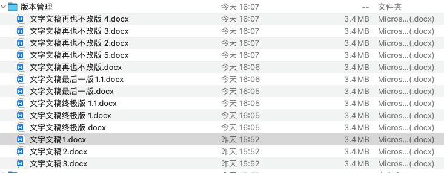
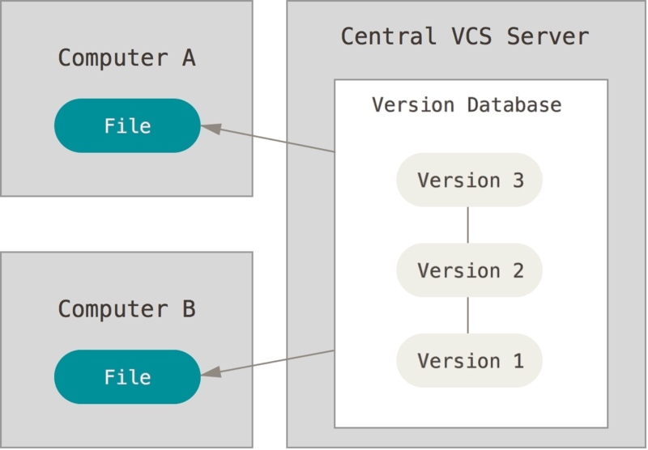
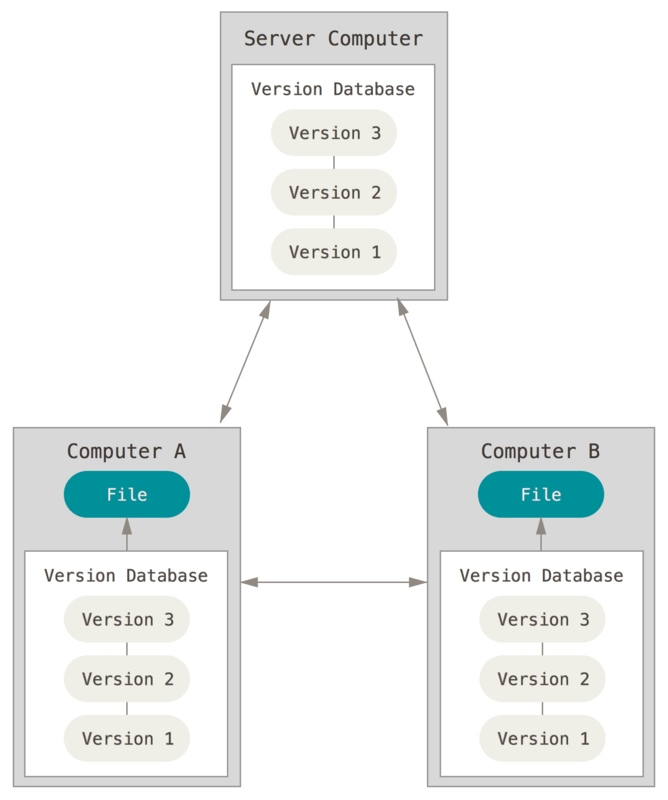
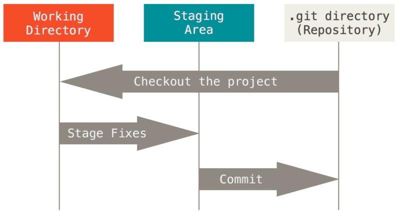

# Git

## 从版本控制开始说起

版本管理一直以来都是挺烦人的事情，比如看下面的图

这还只是一个文件，当涉及到网络和多人协作的大型项目时，那简直是恐怖的灾难。不过很显然，在计算机的世界，有需要就会有轮子，如果没有，那就造一个

## 版本管理的思想

### 中心化管理 SVN

版本库放在中心服务器，所有人必须获得最新的版本，在最新的版本上提交他们的修改



### 分布式管理 Git




## Git

基于差异和分支的管理


存储目录

文件状态：
U、M、A


## 安装Git

Linux
```
sudo apt install git
```

Windows:下载Git bash

## 开始实战

初始化
```
git init
```
配置
```
git config --global user.name "John Doe"
git config --global user.email johndoe@example.com
git config --list
```
使用
```
git clone
git status
git add .
git commit -m ""
git commit 
git commit -a -m
git push 
git pull
```
远程
```
git remote 
git remote add pb https://github.com/paulboone/ticgit
git push origin master
```
分支
```
git branch testing
git checkout testing
git merge hotfix
```


## 实践

### 本地的版本管理

工作区、暂存区、本地仓库
文件、分支、提交
```
git init
git config --global 
```

```
git add .
git commit 
git branch 
```
```
git branch 

```
### 和别人联网使用

远程仓库
```
remote
```
