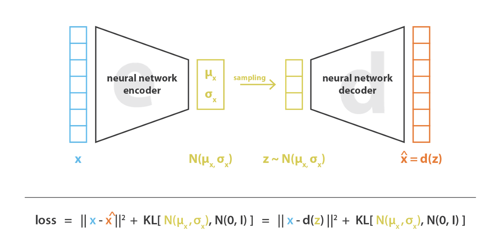

[语音方向的会议、竞赛、期刊](https://zhuanlan.zhihu.com/p/400091001)

## 如何评价和查找会议、论文质量
### h5

https://zhuanlan.zhihu.com/p/392569545

## Paper with code

https://paperswithcode.com/
## Deeplake

https://github.com/activeloopai/deeplake

## 什么是研究创新点与研究意义
https://zhuanlan.zhihu.com/p/496886699

## 
https://www.zhihu.com/people/l349074299
量子纠缠态
CV/ASR领域搬砖工，目前主要精力在视觉大模型

##  AE（DAE,CAR,VAE）

https://zhuanlan.zhihu.com/p/150814670

## Seq to Seq 和 Encoder Decoder

## 
## Attention

https://imzhanghao.com/2021/09/01/attention-mechanism/