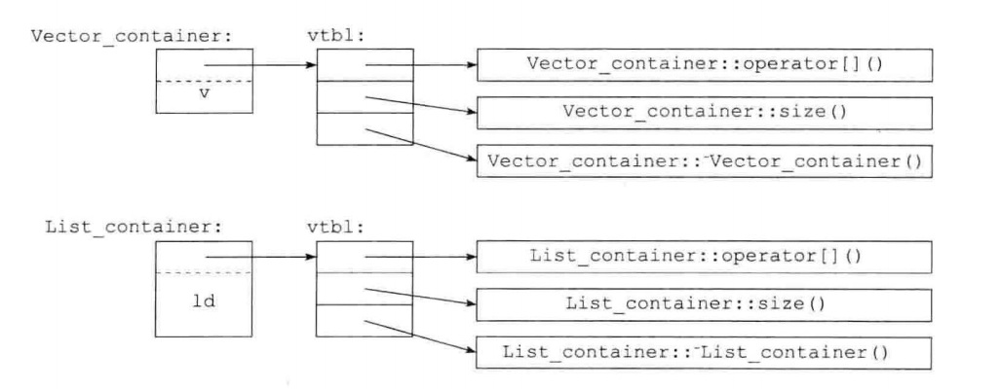

## C++的初始化
[参考](https://en.cppreference.com/w/cpp/language/initialization)

### Direct initialization
- 复制初始化: int a = 5
- 直接初始化: int a(5)
复制初始化和列表初始化不会检查类型，支持`narrow-convert`，下面都会被转化为`int`,值为`12`
```
int a = 12.5;
int a(12.5);
```
### Uniform initialization 
- 列表初始化: int a{5}
这种初始化不允许发生`narrow-convert`，`int a{5.0}`会报错


### Structured Binding (C++ 17)
用于返回多个值
```C++
std:: tuple<std::string, std: :string, std:: string>getClassInfo(){
    std::string className = "Cs106L";
    std::string buildingName= "Turing Auditorium" ;std: :string language ="C++";
    return {className, buildingName, language};
}
int main(){
    auto [className, buildingName, language ] = getClassInfo();
    std: :cout << "Come to " << buildingName
    << " and join us for " <<className
    <<" to learn " << language<<"!" << std: :endl;
    return 0;
}
```
## 初始值列表构造函数
下面两个赋值语句实际上等同于调用了下面的函数
```
Vector a { 1,2,3,4}
Vector a = { 1,2, 3,4}
Vector(std::initializer_list<int>);
```
不过这样的调用时不被允许的`Vector a = {1, 2, 3,1.2}`，花括号内的元素必须保持一致

## 对象切片

C++类似Java，一个类对象有静态类型和动态类型，动态类型主要用于实现多态性，而静态类型则在编译时用于类型检查和确定可调用的方法
```
Class Base{};
Class Derived:public Base{};
Base obj = Derived();
Base *ptr = new Derived();
```
在`C++`中，`obj`对象的动态类型和静态类型均为`Base`，`ptr`对象的静态类型为`Base*`,动态类型为`Derived*`，`obj`对象之所以动态类型还是`Base`的原因是发生了对象切片，`Derived`对象被隐式强制转化为了`Base`对象，这样的转化会导致`Derived`对象丢失新添加的属性和方法，同名的方法也以`Base`为准
## 父类与子类的同名函数
当父类和子类之间有了同名但不同参数的函数后，子类并不会和父类的同名函数重载，而是会隐藏父类的函数
```
#include <iostream>

class Base {
public:
    void function(int x) {
        std::cout << "Base::function(int): " << x << std::endl;
    }
};

class Derived : public Base {
public:
    void function(double x) {
        std::cout << "Derived::function(double): " << x << std::endl;
    }
};

int main() {
    Derived d;
    d.function(10); // 输出 "Derived::function(double): 10.0"

    // 通过作用域解析运算符来调用父类中被隐藏的同名函数
    d.Base::function(20); // 输出 "Base::function(int): 20"

    return 0;
}
```
输出如下，d.function(10)发生了隐式转化
```
Derived::function(double): 10.0
Base::function(int): 20
```
但是如果删除子类中的参数会报错,因为父类的函数被隐藏，同时在子类中找不到可以用的函数
```
class Derived : public Base {
public:
    void function() {
        std::cout << "Derived::function(double): " << std::endl;
    }
};
```
如果完全删除，那么子类就会继承父类的函数

## 虚函数
`virtual`属性表明该函数是动态绑定的,当子类和父类的
```
#include <iostream>
using namespace std;
class base{
public:
	void info(){
		cout<<"Base called"<<endl;
	}
	virtual void virtual_info(){
		cout<<"Base virtual called"<<endl;
	}
	
};
class derived:public base{
public:
	void info(){
		cout<<"Derived called"<<endl;
	}
	void virtual_info(){
		cout<<"Derived virtual called"<<endl;
	}
};
int main(){
	base ptr = derived();
	ptr.info();
	ptr.virtual_info();
	base *ptrs = new derived();
	ptrs->info();
	ptrs->virtual_info();
}
```
输出如下:
```
Base called                                                                                                                   │
Base virtual called                                                                                                           │
Base called   
Derived virtual called  
```
注意，函数覆盖必须要求函数名和参数都相同，

## 虚函数的本质
编译器为所有含有或者继承了虚函数的类生成一个虚函数表，调用函数时通过指针来确定运行时的函数(如果不是虚函数，那么会直接指向代码段中静态类型编译的某个确定函数)

如果类包含虚函数，每一个该类的每个对象需要一个额外的指针; 每个指针都指向额外分配的虚函数表

## 继承与析构、构造
派生类的析构和构造函数会覆盖基类的析构和构造函数，但是会隐式调用构造和析构函数
```
#include <iostream>
using namespace std;
class base{
public:
	base(){
		cout<<"Base init"<<endl;
	}
	base(int a){
		cout<<"Base init with int params"<<endl;
	}
	~base(){
		cout<<"Base del"<<endl;
	}
	
};
class derived:public base{
public:
	derived(){
		cout<<"Derived init"<<endl;
	}
	derived(int a){
		cout<<"Derived init with int params"<<endl;
	}
	~derived(){
		cout<<"Derived del"<<endl;
	}
};
int main(){
	derived();
	derived(1);
}

```
不过令我惊讶的是，输出如下,即使派生类附带参数，默认调用的基类构造函数仍然是不带参数的Base init，并且调用顺序很有意识
```
Base init
Derived init
Derived del
Base del
Base init
Derived init with int params
Derived del
Base del

```
## 左值和右值

左值:左值通常指的是可以取地址的表达式,左值可以出现在赋值语句的左边或右边

右值:右值通常指的是不可取地址的表达式，它们通常是临时的、无法被修改的值。
```
int x = 5; // x 是左值，5 是右值
int* ptr = &x; // &x 是左值，可以取地址
int* ptr2 = &5; // 错误！&5 是右值，无法取地址

int func(); // 声明一个返回值为 int 的函数
int a = func(); // func() 是右值，返回值被赋给左值 a

int& lref = x; // lref 是左值引用，引用了左值 x
int&& rref = 5; // rref 是右值引用，引用了右值 5

int arr[5]; // arr 是左值，数组名可以取地址
int* parr = arr; // arr 是左值，可以赋给指针

```

## 移动构造函数

当定义某种操作时，我们可能不希望频繁的复制临时变量(右值)，因此我们除了定义拷贝构造函数、拷贝赋值函数外还可以定义构造移动函数、赋值移动函数。

移动的意思是使用右值引用，不复制右值


```
// Move constructor.
MemoryBlock(MemoryBlock&& other) noexcept
   : _data(nullptr)
   , _length(0)
{
   std::cout << "In MemoryBlock(MemoryBlock&&). length = "
             << other._length << ". Moving resource." << std::endl;

   // Copy the data pointer and its length from the
   // source object.
   _data = other._data;
   _length = other._length;

   // Release the data pointer from the source object so that
   // the destructor does not free the memory multiple times.
   other._data = nullptr;
   other._length = 0;
}

// Move assignment operator.
MemoryBlock& operator=(MemoryBlock&& other) noexcept
{
   std::cout << "In operator=(MemoryBlock&&). length = "
             << other._length << "." << std::endl;

   if (this != &other)
   {
      // Free the existing resource.
      delete[] _data;

      // Copy the data pointer and its length from the
      // source object.
      _data = other._data;
      _length = other._length;

      // Release the data pointer from the source object so that
      // the destructor does not free the memory multiple times.
      other._data = nullptr;
      other._length = 0;
   }
   return *this;
}
```
## 构造函数还是复制操作、explicit与隐式调用
```
class Myclass:
public:
    Myclass(int a){
        ...
    }
    Myclass operator=(int a)
    {
        ...
    }
```
下面这个隐式调用了构造函数`Myclass(int a)`
```
int a =4;
Myclass obj = a;
```
下面这个才是调用复制操作符`Myclass operator=(int a)`
```
Myclass obj;
obj = a
```
使用explicit可以阻止隐式调用构造函数
```
explicit Myclass(int a){
        ...
    }

```

## 禁止默认构造函数
C++会默认提供拷贝和移动函数，但是因为我们不知道
```
class Shape{
public:
    //删除默认的拷贝函数
    Shape(const Shape&) = delete;
    Shape& operator = (const Shape&) = delete;
    //删除默认的移动函数
    Shape(Shape&&) = delete;
    Shape&& oeprator=(Shape &&) = delete;
}
```

