# Hello world

本课程记录根据`CS106B/L 2024`系列课程，前者比后者简单，推荐有其他语言基础的直接从`CS106L`入手，[课程主页](https://web.stanford.edu/class/cs106l/).

# 主要内容
## CH2：类型与机构
### C++简介

C++ = Basic sytax + STL(Standard Template Libary)
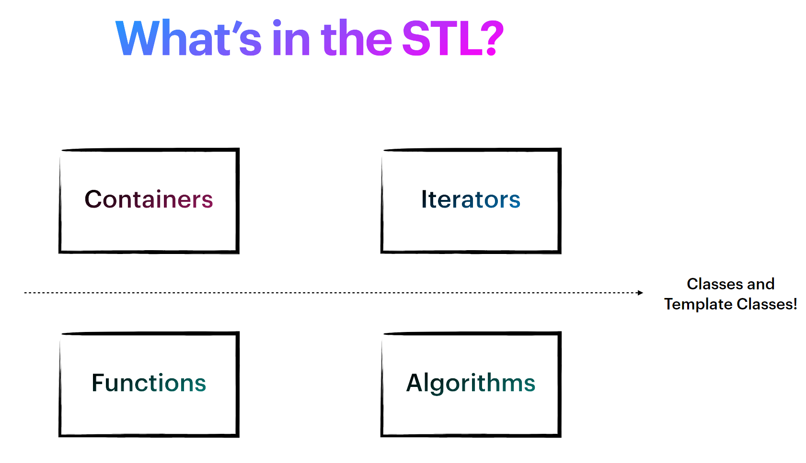
`C++` 具有命名空间，支持函数重载

`C++` 是一门"静态类型的“、"编译的"

`C++` 支持`auto`
### Pair和Tuple

`pair`是`STL`的结构体，定义如下
```
struct Pair {
fill_in_type first;
fill_in_type second;
};
```
`pair`实例
```
auto info = std::make_pair("WangFang",27);
std::cout<<info.first<<":"<<info.second;
```
`tuple`与`pair`类似，但是获取元素需要通过`get`函数
```
std::tuple<int,int,string> test= std::make_tuple(1,2,"2");
std::cout<<get<0>(test);
```

### Structured Binding (C++ 17)

通过`Auto`和`Pair/Tuple`用于返回多个值
```C++
std:: tuple<std::string, std: :string, std:: string>getClassInfo(){
    std::string className = "Cs106L";
    std::string buildingName= "Turing Auditorium" ;std: :string language ="C++";
    return {className, buildingName, language};
}
int main(){
    auto [className, buildingName, language ] = getClassInfo();
    std: :cout << "Come to " << buildingName
    << " and join us for " <<className
    <<" to learn " << language<<"!" << std: :endl;
    return 0;
}
```

## CH3:Initialization and References

初始化参考[参考](https://en.cppreference.com/w/cpp/language/initialization)

### Initialization

- 复制初始化: int a = 5,调用operater=函数
- 直接初始化: int a(5),调用构造函数，比如 MyClass(int a) : data(a) {}
复制初始化和列表初始化不会检查类型，支持`narrow-convert`，下面都会被转化为`int`,值为`12`
```
int a = 12.5;
int a(12.5);
```
- 列表初始化: int a{5},调用列表构造函数，比如Myclass(std::initializer_list<int> values)
- 聚合初始化: int a = {5},不调用构造函数，进行成员的逐个初始化
列表初始化初始和聚合初始化不允许发生`narrow-convert`，`int a{5.0}`会报错

### Reference

引用只能引用左值

### L Value and R Value

左值是程序向系统申请了地址空间的值，存储在内存当中，可以取地址的，右值是临时产生的值，存放在寄存器中，不可以取地址

## CH4:Contianer

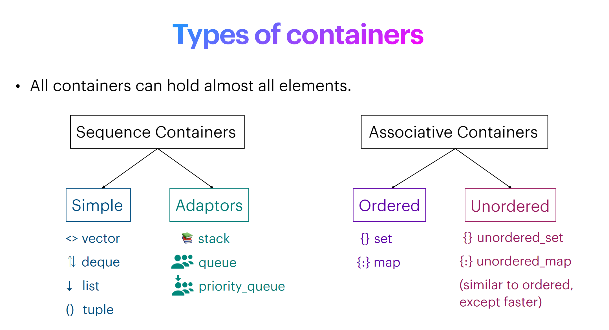
`vector`实际上是数组，包含有`_size`和`_capcity`两个隐藏属性
```
push_back
back
insert
erase
```
`deque`双端队列实际上是数组链表，每个链接指向能够容纳`8`（通常）个元素的数组
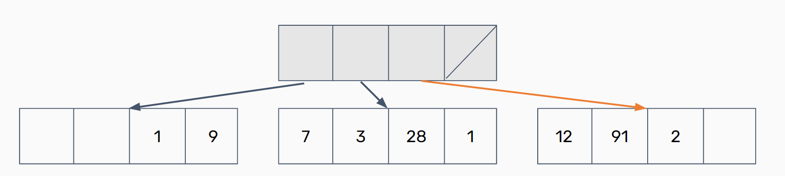

有序的集合需要定义元素的比较操作符，无序的需要定义元素的哈希函数，通常后者更快

`set`
```
insert
erase
find
```

## CH5:Stream
### 基本概念

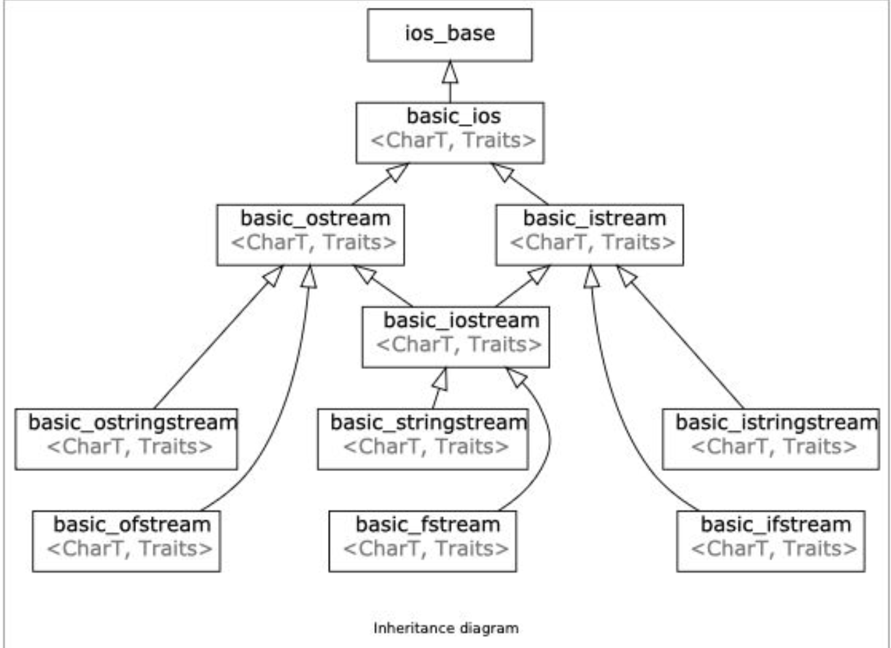
流的本质是一个`streambuf`
```
std::streambuf
```
`rdbuf()`可以获取`streambuf`的指针，`streambuf`支持`sputc/sputn`函数来输入，或者`sgetc/sgetn`函数来读取

`ofstream`, `ifstream` 和`fstream`是对前者的高级封装
- 通过`good`,`fail`,`eof`'`bad`四个状态来管理流
- 通过位置指针`std::streampos`来管理读写位置
- 通过`std::ios::openmode`来管理读写行为
- 通过`std::ios::fmtflgas`来管理流的行为
- 封装`<<`、`>>`操作符和函数`write`、`read`
- 提供操作标志

### 状态管理

- `good`:正常读写
- `fail`:某次读写失败，未来读写都会失败
- `eof`:到达末尾，未来读写都会失败
- `bad`:遇到未知错误，未来读写都会失败
可以通过`fail`函数查看状态，下面的操作符`<<`实际上返回的就是的标字位`good`的值
```
stringstream ss("13 14 Hello world\n 23")
int num;
while(ss>>num){
    cout<<num;
}
```

### Openmode

默认的`openmode`如下
```
fstream f("a.txt", ios_base::in | ios_base::out);
ifstream g("a.txt", ios_base::in);
ofstream h("a.txt", ios_base::out);
```
`openmode`如下，并不互相矛盾
- std::ios::in，提供写封装
- std::ios::out，提供读封装
- std::ios::ate，可以修改写指针，指针开始处于结尾，但是默认为Trunc的模式，会覆盖掉打开的文件内容
- std::ios::app，写指针无法被修改，始终处于末尾
- std::ios::trunc，截断原文件
- std::ios::binary，将内容是为二进制而非文本

注意初始化的时候默认写指针处于开始，下面的情况需要使用ate或者app
```
stringstream ss("Hello world\n");
ss<<"GoogBye\n";
```

### fmtflgas

```
#include <iostream>
 
int main()
{
    const int num = 150;
 
    // using fmtflags as class member constants:
    std::cout.setf(std::ios_base::hex, std::ios_base::basefield);
    std::cout.setf(std::ios_base::showbase);
    std::cout << num << '\n';
 
    // using fmtflags as inherited class member constants:
    std::cout.setf (std::ios::hex, std::ios::basefield);
    std::cout.setf (std::ios::showbase);
    std::cout << num << '\n';
 
    // using fmtflags as object member constants:
    std::cout.setf(std::cout.hex, std::cout.basefield);
    std::cout.setf(std::cout.showbase);
    std::cout << num << '\n';
 
    // using fmtflags as a type:
    std::ios_base::fmtflags ff;
    ff = std::cout.flags();
    ff &= ~std::cout.basefield;   // unset basefield bits
    ff |= std::cout.hex;          // set hex
    ff |= std::cout.showbase;     // set showbase
    std::cout.flags(ff);
    std::cout << num << '\n';
 
    // not using fmtflags, but using manipulators:
    std::cout << std::hex << std::showbase << num << '\n';
}
```

### <</>>和getline()

`>>`操作符会跳过输入流中的空白字符（包括空格、制表符、换行符等），直到遇到非空白字符为止。这意味着，当使用 `>>`操作符读取数据时，如果输入流中存在空白字符，则会被自动跳过，直到找到下一个非空白字符，不会消耗空白符号、

`getline`的默认行为等同于`getline(ofs,buff,'\n')`,读取数据直到遇见分割符号，会消耗掉分割符

### `\n`和std::endl

`std::end = `\n`+std::flush()`,通常而言我们不主动刷新性能会好很多，刷新是昂贵的

## CH6 Iterators and Pointers

`iterators`有五个层次
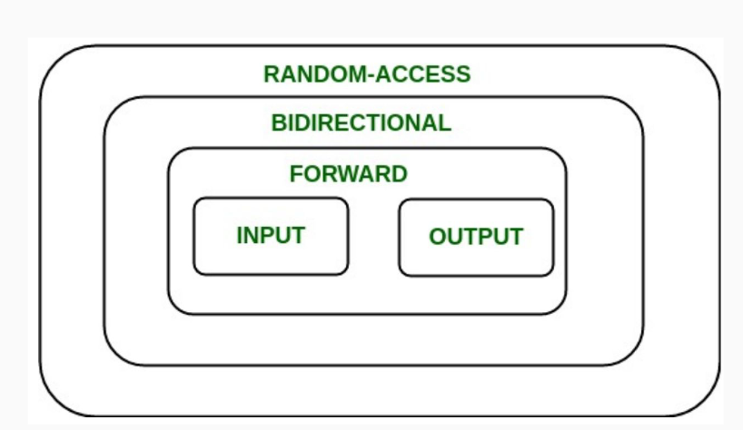
- `input`:支持auto elem = *it
- `output`:支持*it = elem
- `forward`:支持it增加，比如++;
- `bidirection`:支持it减少，比如--
- `Ramdom`:支持随机访问，比如it += 5
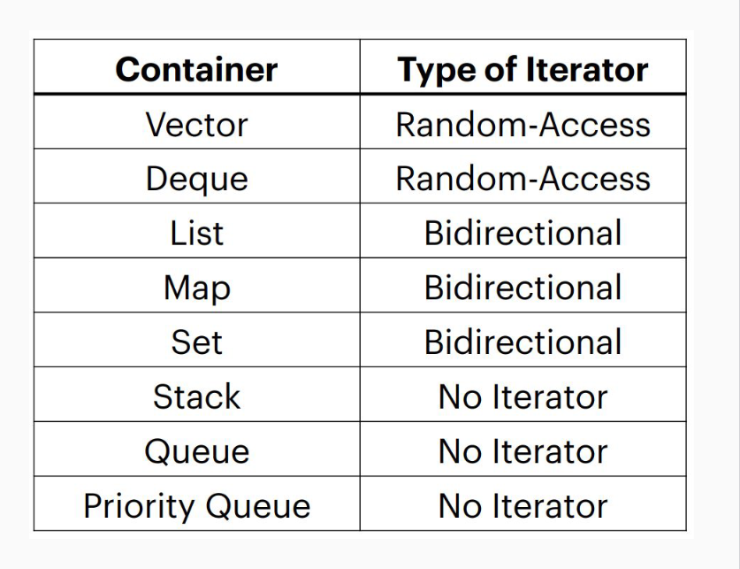
本质上迭代器就是指向目标元素的指针，支持解引用

```C++
std::map<int, int> map;
for(auto iter = map.begin(); iter != map.end(); iter++) {
    const auto& [key, value] = *iter; // structured binding!
}
```

## CH7 Classes


### 重载与继承

子类和父类之间的同名函数（不同参数）不会发生重载，子类的函数会直接覆盖父类

### 对象切片

`C++`类似`Java`，一个类对象有静态类型和动态类型，动态类型主要用于实现多态性，而静态类型则在编译时用于类型检查和确定可调用的方法
```
Class Base{};
Class Derived:public Base{};
Base obj = Derived();
Base *ptr = new Derived();
```
在`C++`中，`obj`对象的动态类型和静态类型均为`Base`，`ptr`对象的静态类型为`Base*`,动态类型为`Derived*`，`obj`对象之所以动态类型还是`Base`的原因是发生了对象切片，`Derived`对象被隐式强制转化为了`Base`对象，这样的转化会导致`Derived`对象丢失新添加的属性和方法，同名的方法也以`Base`为准

### 虚函数

编译器为所有含有或者继承了虚函数的类生成一个虚函数表，调用函数时通过指针来确定运行时的函数(如果不是虚函数，那么会直接指向代码段中静态类型编译的某个确定函数)

如果类包含虚函数，每一个该类的每个对象需要一个额外的指针; 每个指针都指向额外分配的虚函数表，虚函数可以解决对象切片的问题

### 纯虚函数与接口

定义了纯虚函数的类被称为接口，纯虚函数没有地址，继承的子类必须实现纯虚函数


## CH8:Template Classes and Const Correctness

模板可以用于函数或者类,`class`和`typename`相同,支持默认参数
```C++
template<class T> class Myclass{...}
template<typename T> void func(T t);
template<typename T=int> func(T t);
```
注意定义具有模板的类的函数时，
```c++
template<class T> class Myclass{...}
template<class T> void Myclass<T>::func(){...}
```
> [!NOTE]
> 模板类无法在只是包含头文件的情况下编译，必须在头文件结尾加上#include "xx.cpp"


### const_cast

```
int& findItem(int value) {
    for (auto& elem: arr) {
        if (elem == value) return elem;
    }
    throw std::out_of_range(“value not found”)
}
const int& findItem(int value) const {
    return const_cast<int&>((*this).findItem(value))
}

```
### [Constrains and concept](https://en.cppreference.com/w/cpp/language/constraints)

`concept`是`constraint`的集合，可以包含一个或者多个`constraint`

最常见的`constraint`是`requires`，编译器对`requires`进行语义检查
```
template<class name>
concept Addable = requires(T a,T b){
    a + b;
};
```
下面两种都是使用concept的方式，都可以
```
template<class T> requires Addable
class Myclass{...}

template<Addable T> 
class Myclass{...}
```
模版还会进行隐式推导`concept`
```
template<class T, class U>
concept Derived = std::is_base_of<U, T>::value;
template<Derived<Base> T>
void f(T); // T is constrained by Derived<T, Base>
```
模版可以用于传递任何东西，包括常量，函数指针，会进行auto推导
```
template<int n>
int func(){
    return n;
}
func<10>();
```
注意`C++`内置了很多`concept`
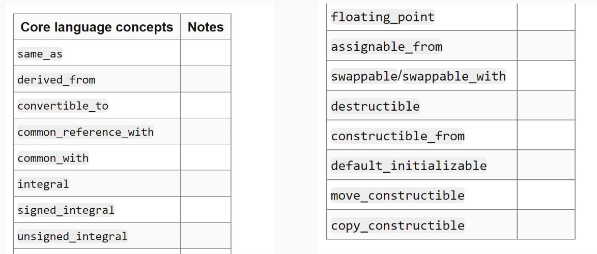

下面是一些常见的`concept`
可哈希约束
```
template<typename T>
concept Hashable = requires(T a)
{
    { std::hash<T>{}(a) } -> std::convertible_to<std::size_t>;
};
```
子类约束
```
template<class T, class U>
concept Derived = std::is_base_of<U, T>::value;
```
数字类型
```
#include <type_traits>
#include <concepts>

// 约束为整数类型的concept
template <typename T>
concept Integral = std::is_integral<T>;

// 约束为浮点类型的concept
template <typename T>
concept FloatingPoint = std::is_floating_point<T>;

// 约束为数字类型的concept（整数或浮点）
template <typename T>
concept Numeric = Integral<T> || FloatingPoint<T>;
```

内置的Concept[参考](https://en.cppreference.com/w/cpp/concepts)，Requires[参考](https://en.cppreference.com/w/cpp/named_req)

### 模版元编程 template metaprogramming

模版会在编译的时候进行替换，因此我们可以通过模版来进行加速
```c++
template<unsigned n>
struct Factorial{
enum {value =n*Factorial<n-1>::value };
};
template<>//template class "specializationstruct Factorial<0>fenumfvalue=1};
struct Factorial<0>{
enum { value = 1 };
};
std::cout << Factorial<10>::value <<endl; // prints 3628800,but run during compile time!
```
### constexpr 常量表达式

常量表达式是的一种属性，必须在编译的时候就可以确定值，因此必须为`const`或者常量
```
constexpr double fib(int n) { // function declared as constexpr
if (n == 1) return 1;
return fib(n-l) * n;
}
int main() {
const long long bigval = fib(20);
std: : cout << bigval << std::endl;
}
```

## CH10:Functions and Lambdas
### 模版函数指针

```
#include <iostream>
#include <string>
using namespace std;
bool isVow(char c){
    string vowel = "aioue";
	return vowel.find(c) != string::npos;
}
template <typename InputIt,typename BinPred>
int countOccurrences(InputIt begin,InputIt end,BinPred isTure){
    int count=0;
    for (auto iter =begin;iter !=end;++iter)
    {
        if(isTure(*iter))
            count++;
        }
    return count;
}

int main(){
	std::string test = "jsfldfjaf";
	std::cout<<countOccurrences(test.begin(),test.end(),isVow);

}
```

### lambdas

`lambdas`由`capture-clause`、`param`、`Function body`组成
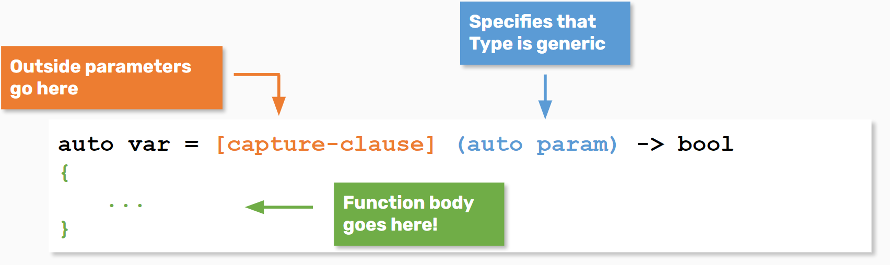
`capture-clause`用于捕获匿名函数外围参数用在匿名函数里面，值捕获相当于副本，
- [] :不捕获
- [limit] :值捕获
- [&limit]:引用捕获
- [&limit, upper]:引用捕获limit,:值捕获upper
- [&,limit]:引用捕获所有，除了limit值捕获
- [&]:引用捕获所有
- [=]:值捕获所有

###  Functor

重载了()操作符的称为Functor

### 标准函数转换

lambda、函数指针、functors都能够被转换为标准函数
```
std::function<return_type(param_types)> func;
```
### 虚函数 virtual function

### algorithm

any_of all_of none_of

for_each

find search

copy

## CH11:Operator Overloading

重载操作符由两种方式，成员函数重载，友元函数重载，前者可以使用this，后者不可以
```
class student {
    public:
    friend bool operator < (student lf,student rs) {
        return true;
    };
    bool operator<(const student& other) const {
        return true;
    }
    
};

int main(){
    student a;
    student b;
    // a < b;
}	
```
友元函数和普通的全局操作符重载的区别是，友元函数可以访问类的私有变量
```
//友元函数重载
class student {
    public:
    friend bool operator < (student lf,student rs) {
        return true;
    };
    bool operator<(const student& other) const {
        return true;
    }
    
};
//普通的全局操作符重载
bool operator < (student lf,student rs) {
        return true;
};
```
下面的操作符不可以重载
```
:: ? . .* sizeof()
typeid() cast()
```
甚至连new都可以重载,注意会影响全局的变量
```
void * operator new(size_t size);
```

## CH12:Special member functions

一个类默认会生成六个特色的成员函数SMF
```
class PasswordManager{
public :
PasswordManager(); //默认构造函数
~PasswordManager(); //默认析构函数
PasswordManager(const PasswordManager& pm); //默认复制构造函数
PasswordManager(PasswordManager&& rhs); //默认移动构造函数
PasswordManager& operator=(const PasswordManager& rhs); //默认复制函数
PasswordManager& operator=(PasswordManager&& rhs); //默认移动复制函数
}
```
默认函数的构造或者复制是浅copy，可以通过删除SMF来禁止复制或者重写来实现深copy
```
PasswordManager(const PasswordManager& pm) = delete;
```

当发生如下情况时不会自动生成默认的复制、移动函数
- 声明了非默认的构造、析构函数
- 声明了非默认的复制、移动函数
- 类具有虚函数
- 类具有独占变量
- 类有fininal或者overide??

下面的语句调用的函数如下：
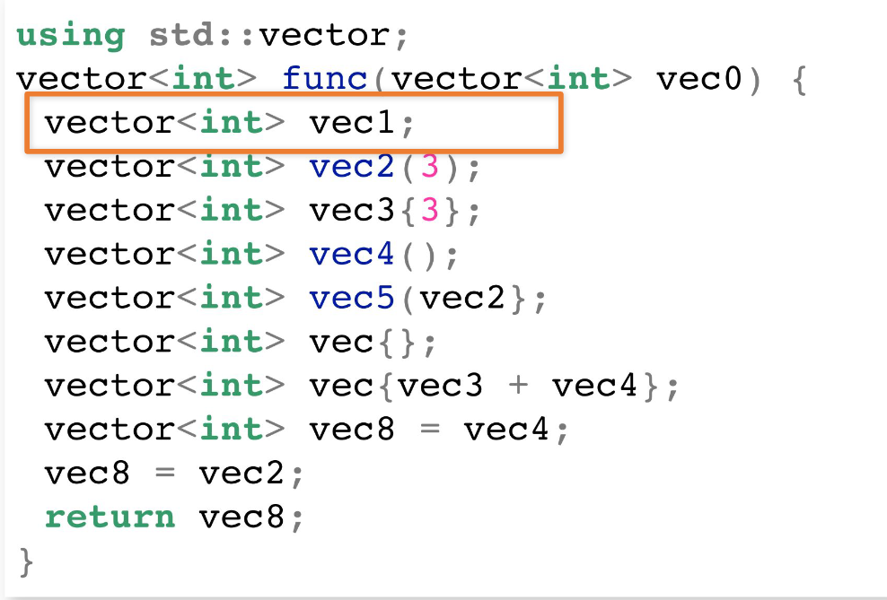
- 默认构造函数
- 复制构造函数
- 初始化列表构造函数
- 函数声明
- 复制构造函数
- 默认构造函数
- 复制构造函数
- 复制构造函数
- 复制函数

### 继承与析构、构造

派生类的析构和构造函数会覆盖基类的析构和构造函数，但是会隐式默认调用构造和默认析构函数(无论是否派生类调用的构造函数是否参数)
```
#include <iostream>
using namespace std;
class base{
public:
	base(){
		cout<<"Base init"<<endl;
	}
	base(int a){
		cout<<"Base init with int params"<<endl;
	}
	~base(){
		cout<<"Base del"<<endl;
	}
	
};
class derived:public base{
public:
	derived(){
		cout<<"Derived init"<<endl;
	}
	derived(int a){
		cout<<"Derived init with int params"<<endl;
	}
	~derived(){
		cout<<"Derived del"<<endl;
	}
};
int main(){
	derived();
	derived(1);
}

```
不过令我惊讶的是，输出如下,即使派生类附带参数，默认调用的基类构造函数仍然是不带参数的Base init，并且调用顺序很有意识
```
Base init
Derived init
Derived del
Base del
Base init
Derived init with int params
Derived del
Base del

```

### 移动函数

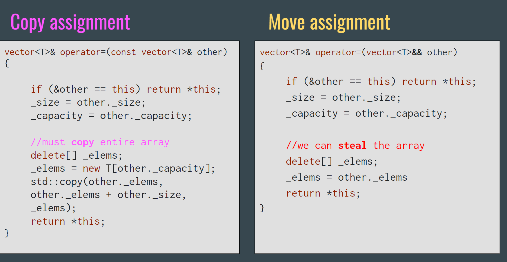

###  move

强制使用移动函数
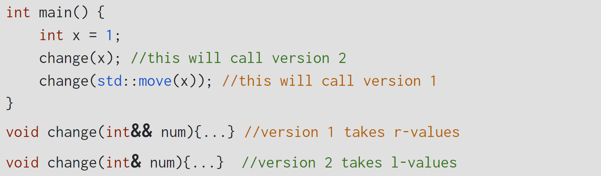
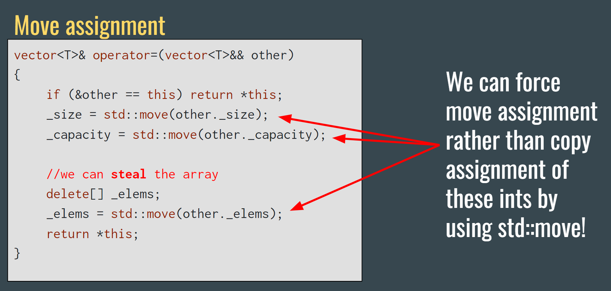
使用const &的地方都可以用move替代
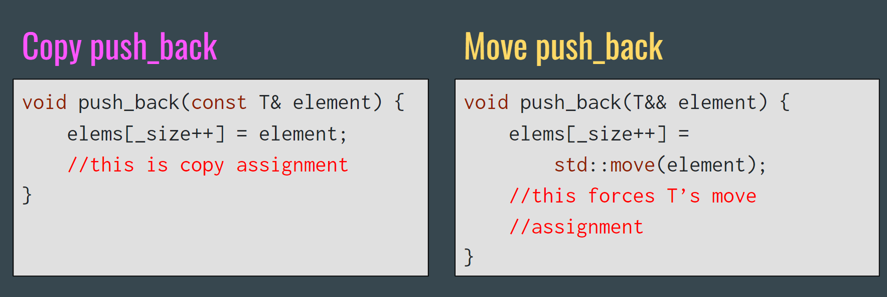

### explicit

C++存在隐式转化，比如复制函数->复制构造函数：Myclass obj = otherobj;
```
class MyClass {
public:
    MyClass(int value) { /* ... */ }
};

void function(MyClass obj) { /* ... */ }

int main() {
    MyClass obj = 10;  // 隐式转换，使用 MyClass 的构造函数
    function(20);     // 同样是隐式转换
    return 0;
}
```
## CH14:Type Safety

当你想要从某个容器中取值的时候，有可能容器为空（或者越界），这时候你可以选择抛出异常，当然也可以通过pair<bool,type>来表示成功与否
```
int& vector<int>::back(){
return *(begin() + size() - 1);
}

```
monadic就是为了处理这种情况下不抛出异常的机制，Monad 这个术语最初来自 Haskell 语言，在C++中有optional来实现,optional可以存放type类型还有nullopt
```
std::optional<int> a;
a = std::nullopt;
a = 4
if(a.value == std::nullopt)
```
optional还提供三个函数
- value():如果有值返回，否则为nullopt抛出异常
- value_or(type defalut)：如果有值返回，否则为返回default
- has_value():

## CH15 RAII

`RAII`是"Resource access is initial"的缩写,意思是资源获取即初始化（同时及时释放）

下面的资源需要我们获取后及时释放
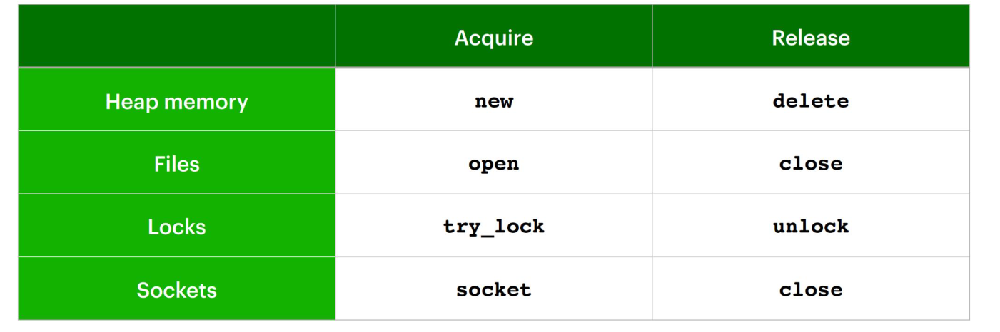
下面的代码在持有锁的过程中，如果发生异常，锁永远不会被释放
```
void cleanDatabase(mutex&databaseLock，map<int,int>&db){
databaseLock.lock();
// no other thread or machine can change database
// modify the database
// if any exception is thrown,the lock never unlocks!
database.unlock();
}
```
### lock_guard

lock_guard会自动获取锁，并且在离开当前代码段时自动释放锁
```
void cleanDatabase(mutex&databaseLock，map<int,int>&db){
lock_guard<mutex> lg(databaseLock);
//
}
```

### smart pointer

智能指针就是针对内存的锁，可以自动获取释放内存，锁分为三种
- std::unique_ptr:不可复制
- std::shared_ptr:可以复制
- std::weak_ptr
unique_ptr独享内存，离开代码范围后自动释放内存，shared_ptr会记录共享内存的指针数量，当没有人持有时才会释放内存，weak_ptr可以访问shared_ptr，但是不会增加共享内存的指针数量

下面时一些实例
```
void rawPtrFn(){
    Node*n=new Node;
    // do smth with n
    delete n;}
void rawPtrFn(){
    std::unique ptr<Node> n(new Node);
    //do something with n
    //n automatically freed
}
```
还可以这样初始化
```
std::unique_ptr<T> uniquePtr{new T};
std::shared_ptr<T> sharedPtr{new T};
std::unique_ptr<T> uniquePtr = std::make_unique<T>();
std::shared_ptr<T> sharedPtr = std::make_shared<T>();
std::weak ptr<T>wp=sharedPtr;
```

## CH16:My practice

```
std::minmax_element
std::mean /std::accumulate
std::for_each
std::copy
std::ostream_iterator
```