# 从零开始学Matplotlib绘图

Matplotlib是绘制图片的利器,支持多种类型的绘制样式,甚至还可以绘制动画,快和我一起来学习吧,本文[参考](https://matplotlib.org/stable/users/explain/quick_start.html#quick-start),关于各种[样例](https://matplotlib.org/stable/gallery/index.html)

## 你好世界
下面是第一个实例
```Python
import numpy as np
import matplotlib.pyplot as plt
x = np.random.random(10)
fig = plt.figure()
ax = fig.add_axes(rect = [0,0,1,1])
ax.plot(x)
ax.set_title("Hello world!")
plt.show()
```


这段实例的主要任务如下,后面所有绘制流程基本相似
- 创建一个画布Figure:plt.figure
- 添加一个画区Axes:fig.add_axes,[左,下,宽,高]=[0,0,1,1]
- 添加一个画件Artist-Line2D:ax.plot
- 添加一个画件Artist-Text:ax.set_title
- 展示绘制图形:plt.show


## 无限可分

使用figure画图的最重要的功能之一是绘制多个图形在一个画布上,即在一张画布上画多个图形
### fig.subfigures()

`fig.subfigures`的参数如下
- `nrows, ncols` : `int`,指定划分子图的网格行列数
- `wspace, hspace` : `float`, 指定子图的水平间距和垂直间距
- `width_ratios` : `array-like of length *ncols`,指定子图的宽度比,数组长度等同与列数
- `height_ratios` : `array-like of length *nrows`,指定子图的高度比,数组长度等同与行数

实例如下,你可以看到的确划分成功了,但是不同画区的显示好像重叠了诶？
```Python
import numpy as np
import matplotlib.pyplot as plt
fig = plt.figure()
sub_figs = fig.subfigures(2,3,wspace=0.1,hspace=0.2,width_ratios=[0.1,0.6,0.1],height_ratios=[0.5,0.5])
for i in sub_figs:
    for j in i:
        j.add_axes([0,0,0.8,0.8,])
plt.show()
```
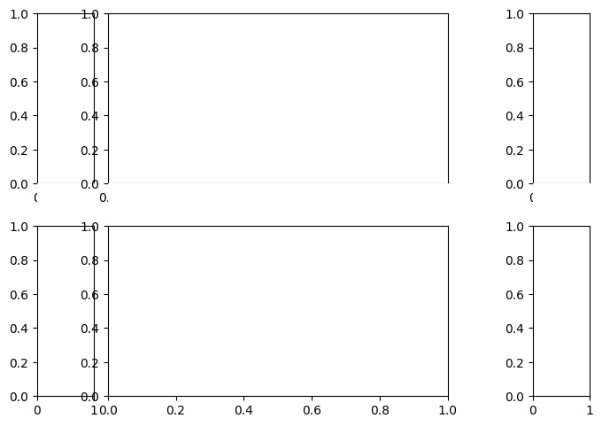

我们在划分子区的时候的确将不同子区对应到了不重叠的子画布上,但是子区默认的[左,下,宽,高]=[0,0,0.8,0.8],左和底的开始位置恰好位于边界,自动在当前添加的刻度会超出边界被下一个子图覆盖,修改为这样就好了
```
j.add_axes([0.2,0.2,0.8,0.8,])
```
另一个方法是使用自动布局,`layout`支持`constrained`、`compressed`、`tight`三种布局,它会帮我们自动的调整被覆盖的位置
```
fig = plt.figure(layout = "constrained")
```

### fig.add_axes()
`fig.add_axes`的参数如下,较为简单不做演示

- `rect`:`(left,bottom,width,height)`,表示新 `Axes `的尺寸。所有值都是相对于图形宽度和高度的分数。

- `projection`:`str`,投影类型的名称,用于指定 `Axes` 的投影方式。可以是预定义的投影类型,如 `'aitoff'`、`'hammer'、'lambert'`、`'mollweide'、'polar'、'rectilinear'`,也可以是自定义投影的名称。默认值为 `None`,表示使用默认的 `'rectilinear'` 投影。

- `polar`:`bool`,表示是否使用极坐标投影。如果设置为`True`,则等效于 `projection='polar'`。
- `sharex、sharey`:`matplotlib.axes.Axes` 对象,用于共享 `x` 轴或 `y` 轴。共享轴将具有与共享轴的原始轴相同的限制、刻度和刻度尺度。
### fig.add_subplot()
`fig.subplot`具有的参数如下
- `projection`,`polar`,`sharex`,`sharey`,`label`:见上
- `args`:`(row, col, index)`或者 `.SubplotSpec`, 默认为 `(1, 1, 1)`,按照指定的行列划分在指定序号的位置创建`Axes`,`.SubplotSpec`见下`fig.add_gridspec()`
### fig.subplots()
`fig.subplots`具有的参数如下,实际上该函数就是调用的fig.add_subplot
- `nrows`, `ncols`,`sharex`,`sharey`
- `width_ratios`,`height_ratios`:`list of array`,长度和行列对齐,指定宽度和长度比
- `squeeze`:`bool`控制返回的 `Axes` 对象的维度,指定后返回一个压缩一维数组(2,3)->(6)
- `subplot_kw`:`dict`,传递给 `Figure.add_subplot` 方法的关键字参数字典。
- `gridspec_kw`:`dict`,传递给 `gridspec.GridSpec` 构造函数的关键字参数字典。


### fig.subplot_mosaic()
`fig.subplot_mosaic`的参数如下
- `sharex`,`sharey`,`width_ratios`,`height_ratios`,`subplot_kw`,,`gridspec_kw`
- `mosaic`:`str`或者`list`,指定划分分区的方式,比较灵活,见下面的示例
- `per_subplot_kw`:`dict`,传递给每个子区的参数
- `empty_sentinel` : `str`,指定无效占位符,默认为.


当`mosaic`为`str`时,`.`表示无效占位符,两个`AA`表示名称为`A`的`Axes`占用两个位置,
```Python
import numpy as np
import matplotlib.pyplot as plt
fig = plt.figure()
sub_figs = fig.subplot_mosaic("AAC;.BC")
sub_figs['A'].plot(x)
```


当`mosaic`为`list`时
```Python
import numpy as np
import matplotlib.pyplot as plt
inner = [
    ["inner A"],
    ["inner B"],
]

outer_nested_mosaic = [
    ["main", inner],
    ["bottom", "bottom"],
]
axd = plt.figure(layout="constrained").subplot_mosaic(
    outer_nested_mosaic
)
plt.show()
```

### fig.add_gridspec()
实际上该函数是调用了`GridSpec`,`GridSpec`的参数如下

- `nrows`, `ncols`,`wspace`,`hspace`,`width_ratios`,`height_ratios`
- `left`, `bottom` `right`, `top` : `float`,指定位置信息,默认为`(0.125,0.1,0.9,0.9)`
该函数生成的参数可以直接给`fig.add_subplot`使用

```Python
import numpy as np
import matplotlib.pyplot as plt
fig = plt.figure(layout, facecolor='lightblue')
gs = fig.add_gridspec(nrows=3, ncols=3, left=0.05, right=1,
                      hspace=0.5, wspace=0.5)
ax0 = fig.add_subplot(gs[:-1, :])
ax1 = fig.add_subplot(gs[-1, :-1])
ax2 = fig.add_subplot(gs[-1, -1])
fig.suptitle('Manual gridspec with right=0.75')
```
也可以直接在该返回值上绘制`subgridspec`,然后使用`subplots`
```Python
def squiggle_xy(a, b, c, d, i=np.arange(0.0, 2*np.pi, 0.05)):
    return np.sin(i*a)*np.cos(i*b), np.sin(i*c)*np.cos(i*d)

fig = plt.figure(figsize=(8, 8), layout='constrained')
outer_grid = fig.add_gridspec(4, 4, wspace=0, hspace=0)

for a in range(4):
    for b in range(4):
        # gridspec inside gridspec
        inner_grid = outer_grid[a, b].subgridspec(3, 3, wspace=0, hspace=0)
        axs = inner_grid.subplots()  # Create all subplots for the inner grid.
        for (c, d), ax in np.ndenumerate(axs):
            ax.plot(*squiggle_xy(a + 1, b + 1, c + 1, d + 1))
            ax.set(xticks=[], yticks=[])

# show only the outside spines
for ax in fig.get_axes():
    ss = ax.get_subplotspec()
    ax.spines.top.set_visible(ss.is_first_row())
    ax.spines.bottom.set_visible(ss.is_last_row())
    ax.spines.left.set_visible(ss.is_first_col())
    ax.spines.right.set_visible(ss.is_last_col())

plt.show()
```

## 设置样式
本文的一大特点就是通过类-对象的方式来学习Matplotlib,当你明白了各个类别和子类之间的属性关系后,你就会发现繁复的属性和函数其实有很多是共通的,你可以不用记忆,在使用中熟悉下面的类属关系。
- `Figure`:`matplotlib.figure.Figure`画布
- `Axes`:`matplotlib.axes._axes.Axes`画区
    - `super`-`_AxesBae`:
    - `dataLim` : `.Bbox`数据范围
    - `viewLim` : `.Bbox`显示范围
    - `xaxis/yaxis`:`XAxis/YAxis`坐标轴
        - `super`-`Axis`:坐标轴基类
        - `XTick/YTick`:刻度
            - `super`-`Tick` 刻度基类
    - `spines`:list of `matplotlib.spines.Spines`封闭线  
        - `super`-`Patch`:基本形状
    - `transAxes`: `BboxTransformTo`:坐标变换
    - `transData`: `Transform`:坐标变换
    - `fmt_xdata`: None | Formatter = ...
    - `fmt_ydata`: None | Formatter = ...

### _AxesBase - 画布
`_AxesBase`具有的基本属性如下
- `_AxesBase` 
     - `facecolor`:`color属性`,设置背景颜色
     - `frameon`:`bool`,设置边缘是否可见
     - `label`:`str`,设置添加的标题
     - `xscale`:`str`,表示 x 轴的缩放类型。可以是以下字符串之一:`'linear'`（线性缩放）、`'log'`（对数缩放）、`'symlog'`（对称对数缩放）或 `'logit'`（逻辑刻度缩放）。默认为 `'linear'`
     - `yscale`:`str`,同`yscale`
     - `box_aspect`:`float`,表示图形的盒子宽高比
     - `fmt_xdata`:`Formatter`
     - `fmt_ydata`:`Formatter`
        

设置空白边缘,`Axes`有一个隐藏属性`ax._xmargin`,支持负数表示覆盖
```Python
import numpy as np
import matplotlib.pyplot as plt
x = np.random.random(10)
fig = plt.figure()
ax = fig.add_subplot(2,2,1)
ax.set_xmargin(-0.1)
ax.plot(x)
plt.show()
```
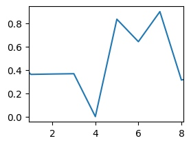

### spines - 封闭线
你注意到上文的实例中有这么一段话,实际上这是在修改`Axes.spines`属性,`spines`属性表示四周的封闭线,包含`top`,`bottom`,`left`,`right`。你可以采用`ax.spines.top`或者`ax.spines['top']`等方式来访问,下面的语句为设置可见性
```
ax.spines.top.set_visible()
```
`spines`的父类是`matplotlib.patches.Patch`,它是 `matplotlib` 中所有二维可视元素的基类,是一个带有面部颜色和边缘颜色的二维可视元素。这个父类包含这些基本属性

- `edgecolor`: `color属性`边缘颜色。
- `facecolor`: `color属性`面部颜色。
- `color`: `color属性`。该参数用于同时设置边缘颜色和面部颜色。如果同时指定了 `color`、`edgecolor` 和 `facecolor`,则 `color` 的优先级最高。
- `linewidth`:`float`,线条宽度。
- `linestyle`: `linestyle属性`。指定图形对象的边缘线条的样式,
- `antialiased`:`bool` 抗锯齿效果。
- `hatch`:`str` 填充图案。指定图形对象的填充图案,可以是字符串(例如 `'/'`、`'\\'`、`'x'`、`'+'`)。默认值为 `None`,表示不使用填充图案。
- `fill`: `bool`填充。指定是否填充图形对象的面部。默认值为 `True`,表示填充面部。
- `capstyle`: `capstyle属性`线条端点样式。
- `joinstyle`: `joinstyle属性`,线条连接方式

```Python
import numpy as np
import matplotlib.pyplot as plt
x = np.random.random(10)
fig = plt.figure()
ax = fig.add_subplot(2,2,1)
ax.set_title("Hello world!")
ax.spines['top'].set_color('C0')
fig.set_frameon(False)
plt.show()
```


> **[info] linestle属性**
> 
> 指定线形的方式可以是`'solod'`或者`'-'
> 
> ``'-'``          solid
> 
> ``'--'``         dashed
> 
> ``'-.'``         dash-dot
> 
> ``':'``          dotted 
> 
 
 


### xaxis/yaxis - 坐标轴
`xaxis/yaxis`是`XAxis/YAxis`的实例,`XAxis/YAxis`继承`Axis`类,同时还具有一个继承了`Tick`类的`XTick/YTick`的属性.

`Axis`是 matplotlib 中用于表示坐标轴的类
- `Axis`:
    - `major` : `matplotlib.axis.Ticker`,表示主刻度
    - `minor` : `matplotlib.axis.Ticker`,表示副刻度
    - `callbacks` : `matplotlib.cbook.CallbackRegistry`
    - `label` : `.Text`,坐标轴标签
    - `labelpad` : `float`,坐标轴标签和坐标轴的距离
    - `offsetText` : `.Text`
    - `majorTicks` : list of `.Tick`,主刻度列表
    - `minorTicks` : list of `.Tick`,副刻度列表

你可以通过下面的函数修改坐标轴`label`和`labelpad`,实际上调用的函数均为`ax.xaxis.label.set_text`和`ax.xaxis.label.update`的封装
```
ax.set_xlabel(xlabel:str,fontdict=None:str,labelpad=None:float,*,loc=None:str, **kwargs)
ax.xaxis.set_label_text(label:str,fontdict:dict,**kwargs)
```

> **[info] loc **
> 
> loc =['center','left','right]'


> **[info] fontdict **
> 


```Python
import numpy as np
import matplotlib.pyplot as plt
x = np.random.random(10)
fig = plt.figure()
ax = fig.add_subplot(2,2,1)
ax.set_xlabel("nihao",labelpad=10,loc="right")
plt.show()
```


#### Ticker 刻度
设置刻度线边界`set_xbound`实际上调用的就是`set_xlim
```
ax.set_xlim
ax.set_xbound
```
```
left : float,         
right : float, 
emit : bool, default: True,是否通知observers界限的改变
auto : bool or None, default: False,是否打开axis的autoscaling
xmin, xmax : float, optional,等同与left和right但是不能同时传递
```
示例
```Python
import numpy as np
import matplotlib.pyplot as plt
x = np.random.random(10)
fig = plt.figure()
ax = fig.add_subplot(2,2,1)
ax.set_xlim(1,2)
ax.plot(x)
plt.show()
```


设置主要刻度线的位置和显示文本
```
ax.set_xticks
ax.set_xticklabels
```
```
import numpy as np
import matplotlib.pyplot as plt
x = np.random.random(10)
fig = plt.figure()
ax = fig.add_subplot(2,2,1)
ax.plot(x)
ax.xaxis.offsetText.set_text("Custom Text")
ax.set_xticks([1,2,3,4])
ax.set_xticklabels(['a','b','c','d'])
plt.show()
```

设置刻度线的尺度,支持`'log'`,`'linear'`,`'logit'`,`'symlog'`
```
ax.set_xscale('log')
```
设置刻度线
```
ax.set_tick_params()
ax.xaxis.set_tick_params()

axis:指定要设置的坐标轴,可以是 'x'、'y' 或 'both'(xaxis无）。
which:指定要设置的刻度线,可以是 'major'、'minor' 或 'both'。
direction:指定刻度线的方向,可以是 'in'、'out' 或 'inout'。
length:指定刻度线的长度。
width:指定刻度线的宽度。
color:指定刻度线的颜色。
pad:指定刻度标签与刻度线之间的间距。
labelsize:指定刻度标签的字体大小。
labelcolor:指定刻度标签的颜色。
bottom、top、left、right:指定是否显示底部、顶部、左侧、右侧的刻度线。
labelbottom、labeltop、labelleft、labelright
```
```Python
import numpy as np
import matplotlib.pyplot as plt
x = np.random.random(10)
fig = plt.figure()
ax = fig.add_subplot(2,2,1)
ax.plot(x)
ax.xaxis.set_tick_params(which='major', width=2, length=10)
plt.show()
```


`Ticker`有两个属性,当然通常情况下我们不需要操作底层的这两个属性,要详细的设置可以参考下面的例子
- `_locator` : `matplotlib.ticker.Locator` 决定刻度的位置
- `_formatter` : `matplotlib.ticker.Formatter` 决定刻度的格式
`axis`中包含两个`Ticker`,`major`和`minor`,分别表示主刻度和副刻度,你可以通过下面的函数获取这些属性

```
ax.xaxis.get_major_locator
ax.xaxis.set_major_locator
ax.xaxis.get_major_formatter
ax.xaxis.set_major_locator

...
```
简单的使用formatter
```
ax0.xaxis.set_major_formatter('{x} km')
ax1.xaxis.set_major_formatter(lambda x, pos: str(x-5))
```
##### locator 坐标位置控制器
Locator 支持下面这些类（注:默认情况下小刻度处于关闭状态（使用NullLocator和NullFormatter））
```
FixedLocator:根据固定位置列表生成刻度。
AutoLocator:根据数据范围和轴长度自动计算刻度位置。
MultipleLocator:在指定基准刻度间隔的倍数上生成刻度。
MaxNLocator:根据指定的最大刻度数量自动计算刻度位置。
LogLocator:在对数刻度上生成刻度。
IndexLocator:根据指定的索引间隔生成刻度。
DateLocator:在日期轴上生成刻度。
```
比如下面的例子

```Python
def setup(ax, title):
    """Set up common parameters for the Axes in the example."""
    # only show the bottom spine
    ax.yaxis.set_major_locator(ticker.NullLocator())
    ax.spines[['left', 'right', 'top']].set_visible(False)

    ax.xaxis.set_ticks_position('bottom')
    ax.tick_params(which='major', width=1.00, length=5)
    ax.tick_params(which='minor', width=0.75, length=2.5)
    ax.set_xlim(0, 5)
    ax.set_ylim(0, 1)
    ax.text(0.0, 0.2, title, transform=ax.transAxes,
            fontsize=14, fontname='Monospace', color='tab:blue')


fig, axs = plt.subplots(8, 1, layout='constrained')

# Null Locator
setup(axs[0], title="NullLocator()")
axs[0].xaxis.set_major_locator(ticker.NullLocator())
axs[0].xaxis.set_minor_locator(ticker.NullLocator())

# Multiple Locator
setup(axs[1], title="MultipleLocator(0.5)")
axs[1].xaxis.set_major_locator(ticker.MultipleLocator(0.5))
axs[1].xaxis.set_minor_locator(ticker.MultipleLocator(0.1))

# Fixed Locator
setup(axs[2], title="FixedLocator([0, 1, 5])")
axs[2].xaxis.set_major_locator(ticker.FixedLocator([0, 1, 5]))
axs[2].xaxis.set_minor_locator(ticker.FixedLocator(np.linspace(0.2, 0.8, 4)))

# Linear Locator
setup(axs[3], title="LinearLocator(numticks=3)")
axs[3].xaxis.set_major_locator(ticker.LinearLocator(3))
axs[3].xaxis.set_minor_locator(ticker.LinearLocator(31))

# Index Locator
setup(axs[4], title="IndexLocator(base=0.5, offset=0.25)")
axs[4].plot(range(0, 5), [0]*5, color='white')
axs[4].xaxis.set_major_locator(ticker.IndexLocator(base=0.5, offset=0.25))

# Auto Locator
setup(axs[5], title="AutoLocator()")
axs[5].xaxis.set_major_locator(ticker.AutoLocator())
axs[5].xaxis.set_minor_locator(ticker.AutoMinorLocator())

# MaxN Locator
setup(axs[6], title="MaxNLocator(n=4)")
axs[6].xaxis.set_major_locator(ticker.MaxNLocator(4))
axs[6].xaxis.set_minor_locator(ticker.MaxNLocator(40))

# Log Locator
setup(axs[7], title="LogLocator(base=10, numticks=15)")
axs[7].set_xlim(10**3, 10**10)
axs[7].set_xscale('log')
axs[7].xaxis.set_major_locator(ticker.LogLocator(base=10, numticks=15))
plt.show()

```

##### formatter 坐标格式控制器
Formatter支持下面这些类
```
StrMethodFormatter:使用字符串的格式方法进行格式化,可以使用类似于 '{}'.format 的格式字符串。
FuncFormatter:使用用户定义的函数进行格式化,函数接受刻度值为参数,返回格式化后的字符串。
ScalarFormatter:对刻度值进行标量格式化,可以指定刻度值的精度、科学计数法等。
FormatStrFormatter:使用格式字符串进行格式化,可以使用类似于 '%.2f' 的格式字符串。
LogFormatter:对对数刻度的刻度标签进行格式化。
PercentFormatter:将刻度值转换为百分比格式。
```

```Python
def setup(ax, title):
    """Set up common parameters for the Axes in the example."""
    # only show the bottom spine
    ax.yaxis.set_major_locator(ticker.NullLocator())
    ax.spines[['left', 'right', 'top']].set_visible(False)

    # define tick positions
    ax.xaxis.set_major_locator(ticker.MultipleLocator(1.00))
    ax.xaxis.set_minor_locator(ticker.MultipleLocator(0.25))

    ax.xaxis.set_ticks_position('bottom')
    ax.tick_params(which='major', width=1.00, length=5)
    ax.tick_params(which='minor', width=0.75, length=2.5, labelsize=10)
    ax.set_xlim(0, 5)
    ax.set_ylim(0, 1)
    ax.text(0.0, 0.2, title, transform=ax.transAxes,
            fontsize=14, fontname='Monospace', color='tab:blue')


fig = plt.figure(figsize=(8, 8), layout='constrained')
fig0, fig1, fig2 = fig.subfigures(3, height_ratios=[1.5, 1.5, 7.5])

fig0.suptitle('String Formatting', fontsize=16, x=0, ha='left')
ax0 = fig0.subplots()

setup(ax0, title="'{x} km'")
ax0.xaxis.set_major_formatter('{x} km')

fig1.suptitle('Function Formatting', fontsize=16, x=0, ha='left')
ax1 = fig1.subplots()

setup(ax1, title="def(x, pos): return str(x-5)")
ax1.xaxis.set_major_formatter(lambda x, pos: str(x-5))

fig2.suptitle('Formatter Object Formatting', fontsize=16, x=0, ha='left')
axs2 = fig2.subplots(7, 1)

setup(axs2[0], title="NullFormatter()")
axs2[0].xaxis.set_major_formatter(ticker.NullFormatter())

setup(axs2[1], title="StrMethodFormatter('{x:.3f}')")
axs2[1].xaxis.set_major_formatter(ticker.StrMethodFormatter("{x:.3f}"))

setup(axs2[2], title="FormatStrFormatter('#%d')")
axs2[2].xaxis.set_major_formatter(ticker.FormatStrFormatter("#%d"))


def fmt_two_digits(x, pos):
    return f'[{x:.2f}]'


setup(axs2[3], title='FuncFormatter("[{:.2f}]".format)')
axs2[3].xaxis.set_major_formatter(ticker.FuncFormatter(fmt_two_digits))

setup(axs2[4], title="FixedFormatter(['A', 'B', 'C', 'D', 'E', 'F'])")
# FixedFormatter should only be used together with FixedLocator.
# Otherwise, one cannot be sure where the labels will end up.
positions = [0, 1, 2, 3, 4, 5]
labels = ['A', 'B', 'C', 'D', 'E', 'F']
axs2[4].xaxis.set_major_locator(ticker.FixedLocator(positions))
axs2[4].xaxis.set_major_formatter(ticker.FixedFormatter(labels))

setup(axs2[5], title="ScalarFormatter()")
axs2[5].xaxis.set_major_formatter(ticker.ScalarFormatter(useMathText=True))

setup(axs2[6], title="PercentFormatter(xmax=5)")
axs2[6].xaxis.set_major_formatter(ticker.PercentFormatter(xmax=5))
```


    
## 添加画件
正如前文所描述的那样,`matplotlib`通过画布-画区-画件的方式管理绘制内容,当你手动添加画区到画布上时,画区已经自带了`Spines`和`Xaxis/Yaxis`、`Ticker`这些基本画件,你还可以自由的添加其他的画件`Artist`,常见的添加函数见下方。(注:`Artist`是任意画件包括`Figure`、`Axes`的基类）
```
add_artist() 可以添加任意类型的可绘制对象到图形容器中（Artist）
add_patch() 用于添加基本的图形元素。(Pathc,Rectangle)
add_line(): 向 Axes 对象添加线条对象 (Line2D)。
add_collection(): 向 Axes 对象添加集合对象 (Collection),如散点图 (Scatter)、柱状图 (Bar) 等。
add_table(): 向 Axes 对象添加表格对象 (Table)。
add_text(): 向 Axes 对象添加文本对象 (Text)。
add_image(): 向 Axes 对象添加图像对象 (AxesImage)。
add_axes(): 向 Figure 对象添加新的坐标系 (Axes)。
add_colorbar(): 向 Figure 或 Axes 对象添加颜色条
add_collection3d(): 向 Axes3D 对象添加集合对象
```
同时你也可以用`getp`函数获取任意画件可以设置的属性
```Python
import matplotlib.artist as martist
line_properties = martist.getp(line)
print(line_properties)
```
### 画件属性与基类
在详细的介绍画件之前,我想先介绍一下通用的属性的设定方式和基本类别属性。
#### color - 颜色色 属性

> **[info] color属性**
> 
> 指定颜色的方式有三种
>
> `str`:`g`或者`green`或者`C0`
> 
>``'b'/C0``          blue
> 
>``'g'/C1``          green
> 
>``'r'/C2``          red
> 
>``'c'/C3``          cyan
> 
>``'m'/C4``          magenta
> 
>``'y'/C5``          yellow
> 
>``'k'/C6``          black
> 
>``'w'/C7``          white
> 
> `tuple`: `(R,G,B)`/`(R,G,B,A)`元祖,比如`(2,34,44)`,`(2,34,44,0.5)`
> 
> `str`:十六进制字符串,`'#008000'`
> 


#### marker - 点形 属性

> **[info]Markers**
> 
```
=============   ===============================
character       description
=============   ===============================
``'.'``         point marker
``','``         pixel marker
``'o'``         circle marker
``'v'``         triangle_down marker
``'^'``         triangle_up marker
``'<'``         triangle_left marker
``'>'``         triangle_right marker
``'1'``         tri_down marker
``'2'``         tri_up marker
``'3'``         tri_left marker
``'4'``         tri_right marker
``'8'``         octagon marker
``'s'``         square marker
``'p'``         pentagon marker
``'P'``         plus (filled) marker
``'*'``         star marker
``'h'``         hexagon1 marker
``'H'``         hexagon2 marker
``'+'``         plus marker
``'x'``         x marker
``'X'``         x (filled) marker
``'D'``         diamond marker
``'d'``         thin_diamond marker
``'|'``         vline marker
``'_'``         hline marker
=============   ===============================
```

#### linestyle - 线形 属性
```
Line Styles

=============    ===============================
character        description
=============    ===============================
``None``.        关闭绘制线
``'-'``          solid line style
``'--'``         dashed line style
``'-.'``         dash-dot line style
``':'``          dotted line style
=============    ===============================
```
#### Hatch - 填充  属性
hatch属性接受以下常见的填充样式：
```
'/'：斜线填充
'\'：反斜线填充
'|'：垂直线填充
'-'：水平线填充
'+'：十字线填充
'x'：X字线填充
'o'：圆圈填充
'O'：大圆圈填充
'.'：点填充
```
```
import matplotlib.pyplot as plt

# 创建一个简单的条形图
x = ['A', 'B', 'C', 'D']
y = [3, 7, 2, 5]

plt.bar(x, y, hatch='///')

# 显示图形
plt.show()
```


#### .Text - 文本 基类
.Text 对象的属性

- `fontfamily/family/fontname`:`str`,字体,内置有{`'serif'`, `'sans-serif'`, `'cursive'`, `'fantasy'`, `'monospace'`}
- `fontvariant/variant` :{'normal', 'small-caps'}
- `fontstretch/stretch`: 宽度，0-1000/{`'ultra-condensed'`：超窄，`'extra-condensed'`：非常窄，`'condensed'`：窄，`'semi-condensed'`：半窄，`'normal'`：正常，`'semi-expanded'`：半宽，`'expanded'`：宽，`'extra-expanded'`：非常宽，`'ultra-expanded'`：超宽}
- `fontstyle` :正常（normal）、斜体（italic）、粗体（bold）
- `fontweight/weight`：字体粗细，`0-1000`/{`'ultralight'`, `'light'`,`'normal'`,`'regular'`,`'book'`,`'medium'`,`'roman'`, `'semibold'`,`'demibold'`,`'demi'`,`'bold'`,`'heavy'`,`'extra` `'bold'`, `'black'`}
- `fontsize` or `size`:`float` or {`'xx-small'`, `'x-small'`, `'small'`, `'medium'`, `'large'`, `'x-large'`, `'xx-large'`}

- `backgroundcolor`:背景色
- `color`:颜色


- `verticalalignment/va`:`str`垂直对齐方式,可选值包括 `'top'`、`'bottom'`、`'center'`、`'baseline'` 等。
- `horizontalalignment/ha`:`str`水平对齐方式,可选值包括 `'left'`、`'right'`、`'center'` 等。
- `multialignment`:`str`多行文本的对齐方式,可选值包括 `'left'`、`'right'`、`'center'` 等。
- `wrap`:`bool`,是否在文本过长时自动换行。
- `linespacing`:`float`,多行文本的行距。

- `usetex`:`bool`,是否使用 TeX 渲染文本。
- `rotation`:`float`,文本的旋转角度。
- `rotation_mode`:`str`,旋转模式,可选值包括 'default'、'anchor'。
- `transform_rotates_text`:`bool`,是否根据坐标轴的变换来旋转文本。
- `parse_math`:`bool`是否解析数学表达式。
- `url`:超链接
### Line2D - 点线


`Line2D`必须需要输入的数据
```
xdata:绘制线条的 x 坐标数据,一个float序列。
ydata:绘制线条的 y 坐标数据,一个float序列。
```
Line2D对象由点`marker`和线`line`组成,支持的属性值如下:`linewidth`,`linestyle`,`color`,`marker`,`markersize`,`markeredgewidth`,`markeredgecolor`,`markerfacecolor`,`markerfacecoloralt`
- `dash_capstyle/solid_capstyle`:设置虚线/实线CapStyle
- `dash_joinstyle/solid_joinstyle`:设置虚线/实线Joinstyle
- `antialiased`:线条是否进行抗锯齿渲染,一个bool,默认为 None。
- `fillstyle`:线条上数据点标记的填充样式,一个字符串,默认为 None。通常情况下`marker`为`None`,因此不会绘制数据点,设置绘制数据点后可以起作用

```Python
import matplotlib.pyplot as plt
import numpy as np

# 创建一个简单的图形
fig, ax = plt.subplots()

# 创建示例数据
x = np.linspace(0, 2*np.pi, 10)
y = np.sin(x)

# 绘制线条
ax.plot(x, y,'o' ,fillstyle='none', label='none')
ax.plot(x, y-0.5, 'o', fillstyle='full', label='full')
ax.plot(x, y-1, 'o', fillstyle='left', label='left')
ax.plot(x, y-1.5, 'o', fillstyle='right', label='right')
ax.plot(x, y-2, 'o', fillstyle='bottom', label='bottom')
ax.plot(x, y-2.5, 'o', fillstyle='top', label='top')

# 添加图例
ax.legend()

plt.show()
```


> **[info] CapStyle**
> 
> ```
> 'butt:线条端点为平直的方形,不延伸过线条的末端。
> 'round:线条端点为圆形。
> 'projecting':线条端点为方形,延伸过线条的末端。
> ```


---
> **[info] JoinStyle**
> 
>```
> miter:连接点为尖角。
> round:连接点为圆角。
> bevel:连接点为平直的斜角
> ```
 

 
- drawstyle
  
> **[info] drawstyle**
> 
> ```
> "default":默认绘制方式,线条将按照给定的坐标点顺序进行插值和绘制
> "steps":绘制阶梯线条,线条会在每个坐标点之间垂直或水平连接,形成阶梯状的线条。
> "steps-pre":与 "steps" 类似,但是线条是从前一个坐标点开始绘制的。
> "steps-mid":与 "steps" 类似,但是线条是从当前坐标点的中间位置开始绘制的。
> "steps-post":与 "steps" 类似,但是线条是从当前坐标点结束位置开始绘制的。
> ```

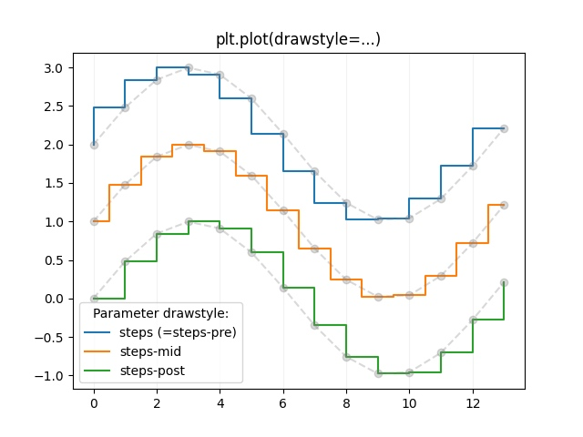

### Text - 文本
`Text`的属性，其他属性见.Text
- `x `/`y`:`float`,文本的位置坐标,分别表示 x 和 y 轴上的值。
- `text`:`str`文本内容。
- `bbox`:`dict`,外框属性，是一个`Rectangle`

```Python
import matplotlib.pyplot as plt

# 创建一个文本框并设置样式
text = plt.text(0.5, 0.5, 'Hello, World!', bbox=dict(facecolor='white', edgecolor='black', boxstyle='round,pad=0.5'))

# 显示图形
plt.show()
```
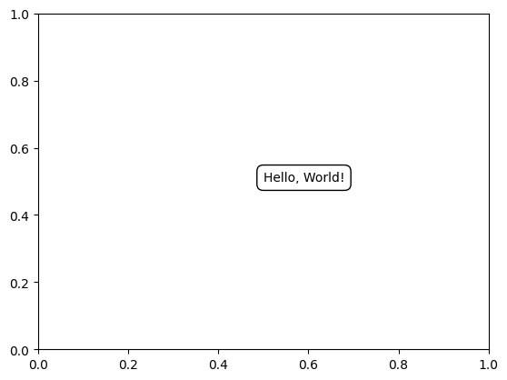

下面是一个简单的示例
```Python
import matplotlib.pyplot as plt
from matplotlib.pyplot import Text
# 创建图表和坐标轴
fig, ax = plt.subplots()

# 添加文本标签
text1 = Text(0.4, 0.4, 'Hello, World!', fontsize=12, color='red')
text2 = plt.Text(0.1, 0.4, 'Hello, World!')
ax.add_artist(text1)
ax.add_artist(text2)
plt.show()
```
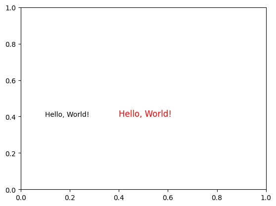

#### Annotation - 带箭头文本
`Annotation`继承了`Text`,是一个带有箭头的`Text`
```
- `text:注释的文本内容。
- xy:注释目标点的坐标。可以是一个二元元组 (x, y),表示数据坐标,或者是一个字符串,表示坐标轴上的特殊位置,如 'center'、'top'、'bottom' 等。
- xytext:注释文本的位置坐标。如果为 None,则默认与 xy 相同。
- xycoords:注释目标点的坐标系。可选值包括 'data'、'axes fraction'、'figure fraction' 等。
- textcoords:注释文本的坐标系。如果为 None,则默认与 xycoords 相同。
- arrowprops:一个字典,包含箭头的属性设置,用于在注释目标点和注释文本之间绘制箭头。常用的属性包括 'arrowstyle'（箭头样式）、'arrowcolor'（箭头颜色）、'connectionstyle'（连接线样式）等。
- annotation_clip:是否将注释裁剪到图表区域。如果为 None,则默认使用 rcParams['annotation.clip'] 的值。
```
基本示例如下
```Python
import matplotlib.pyplot as plt
from matplotlib.text import Annotation

# 创建图表和坐标轴
fig, ax = plt.subplots()

# 创建Annotation实例
annotation = Annotation("Important Point", xy=(0.5, 0.5), xytext=(0.2, 0.8),
                        arrowprops=dict(arrowstyle='->'))

# 将Annotation添加到Axes实例
ax.add_artist(annotation)

# 设置坐标轴范围
ax.set_xlim(0, 1)
ax.set_ylim(0, 1)

# 显示图表
plt.show()
```
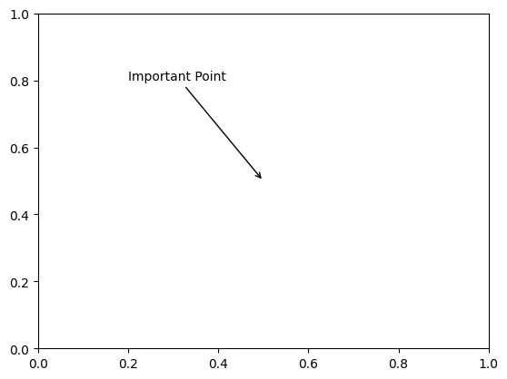


### Patch - 边
`Patch`是一个基类,不能够直接使用,可以使用它的子类,具有的基本属性有`edgecolor`,`facecolor`,`antialiased`,`hatch`,`fill`,`capstyle`,`joinstyle`


#### Rectangle - 矩形
指定的参数有
- `xy` : `(float, float)`
- `width` : `float`
- `height` : `float`
- `angle` : `float`
- `rotation_point` : `{'xy', 'center', (number, number)}`
- `args`:`Patch`支持的参数


```Python
import matplotlib.pyplot as plt
import matplotlib.patches as patches

# 创建图表和坐标轴
fig, ax = plt.subplots()

# 创建矩形对象
rect = patches.Rectangle((0.2, 0.3), 0.5, 0.4, edgecolor='red', facecolor='blue', linewidth=2)

# 添加矩形对象到图表
ax.add_patch(rect)

plt.show()
```
#### Circle - 圆形
支持的参数如下
 - `xy`:圆心坐标
 - `radius`:圆半径
 - `args`:`Patch`支持的参数

 
```Python
import matplotlib.pyplot as plt
import matplotlib.patches as patches

# 创建图表和坐标轴
fig, ax = plt.subplots()

# 创建圆形对象
circle = patches.Circle((0.5, 0.5), radius=0.2, edgecolor='red', facecolor='blue', linewidth=2)

# 添加圆形对象到图表
ax.add_patch(circle)

plt.axis('equal')
plt.show()
 ```
#### Polygon - 多边形
- `*(x,y)`:提供顶点
- `close`:`bool`
- `args`:`Patch`支持的参数


```Python
import matplotlib.pyplot as plt
import matplotlib.patches as patches

# 创建图表和坐标轴
fig, ax = plt.subplots()

# 创建多边形对象
polygon = patches.Polygon([(0.2, 0.2), (0.5, 0.7), (0.8, 0.2)], edgecolor='red', facecolor='blue', linewidth=2)

# 添加多边形对象到图表
ax.add_patch(polygon)

plt.axis('equal')
plt.show()
```
#### Ellipse - 椭圆
- `xy`:圆心坐标
- `width`:横轴长
- `height`:纵轴长
- `angle`:角度
- `args`:`Patch`支持的参数

#### Wedge - 扇形
- `center`:扇形的中心点坐标。
- `r`:扇形的半径。
- `theta1`:起始角度（以度为单位）。
- `theta2`:结束角度（以度为单位）。
- `args`:`Patch`支持的参数

```Python
import matplotlib.pyplot as plt
import matplotlib.patches as patches

# 创建图表和坐标轴
fig, ax = plt.subplots()

# 创建扇形对象
wedge = patches.Wedge((0.5, 0.5), 0.4, 30, 180, edgecolor='red', facecolor='blue', linewidth=2)

# 添加扇形对象到图表
ax.add_patch(wedge)

plt.axis('equal')
plt.show()
```
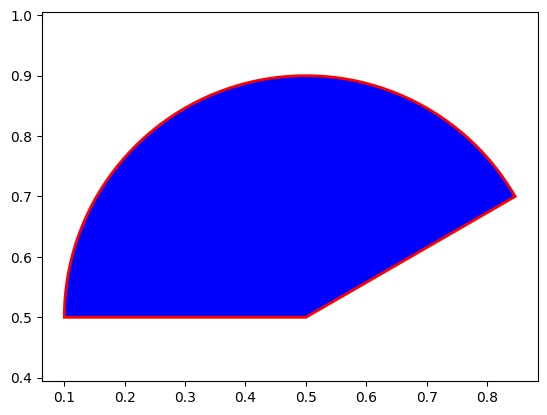

#### Arrow - 箭头
- `x` : `float`,尾部坐标
- `y` : `float`,尾部坐标
- `dx` : `float`,箭头x方向长度
- `dy` : `float`,箭头y方向长度
- `width` : `float`, default: 1
- `args`:`Patch`支持的参数

```Python
import matplotlib.pyplot as plt
import matplotlib.patches as patches

# 创建图表和坐标轴
fig, ax = plt.subplots()

# 创建箭头对象
arrow = patches.Arrow(0.2, 0.2, 0.4, 0.4, width=0.1, edgecolor='red', facecolor='blue')

# 添加箭头对象到图表
ax.add_patch(arrow)

plt.axis('equal')
plt.show()
```

#### FancyArror - 装饰性箭头
和Arrow类似,但是多了一些可以控制的参数

- `length_includes_head`:`bool`,如果为 `True`,则在计算长度时包括箭头的长度。如果为 `False`,则仅计算箭头起点到箭头尖端的长度,默认为 `False`。
- `head_width`:`float`或 `None`,默认值为 `3 * width`,其中 `width` 是箭头主干的宽度。箭头头部的总宽度。如果未指定,将根据主干宽度自动计算。
- `head_length`:`float`或 `None`,默认值为 `1.5 * head_width`。箭头头部的长度。如果未指定,将根据头部宽度自动计算。
- `shape`:字符串,可选值为 `'full'`、`'left'` 或 `'right'`,默认为 `'full'`。指定箭头的形状。`'full'` 表示完整箭头,`'left'` 表示左半箭头,`'right'` 表示右半箭头。
- `overhang`:`folat`,表示箭头的倾斜程度。取值范围可以是负数（表示箭头向后倾斜）或大于 `1`（表示箭头向前倾斜）。默认值为 `0`,表示箭头为三角形形状。
- `head_starts_at_zero`:`bool`,如果为 `True`,则箭头从坐标 `0` 开始绘制,而不是在坐标 `0` 结束。默认为 `False`。
### Legend - 小标题
几乎每一个`Artist`（包括`Figure`、`Axes`、`Line2D`等等）都有一个属性叫`label`（注意和`title`区分，`title`是标题，后者为标记文本），当你启动`legend`时，`lable`才会起作用
`ax.legend`参数如下
- `handles` : sequence of `.Artist`, 
- `labels` : list of `str`, optional
有四种使用方式
```
legend():自动检测每个Artist的label
legend(handles, labels):绘制给定handles所代表的Artist为对应给定labels
legend(handles=handles):绘制给定handles所代表的Artist设定的label
legend(labels):按照Artist添加的顺序绘制labels
```

```Python
import matplotlib.pyplot as plt
import matplotlib.patches as mpatches

fig, ax = plt.subplots()
red_patch = mpatches.Patch(color='red', label='The red data')
ax.legend(handles=[red_patch])

plt.show()
```
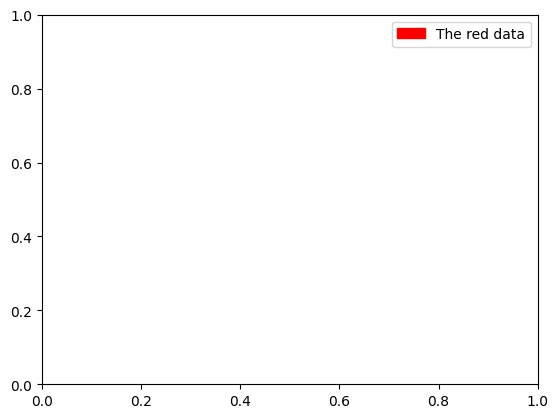

### Path - 路径
所有`matplotlib.patches`对象是采用`Path`绘制的,`Path`移动方式为`位置点`-`动作方式`,支持的动作方式如下
- `STOP`:路径段落类型,表示路径的结束。
- `MOVETO`:路径段落类型,表示移动到一个新的位置,只有一个顶点。
- `LINETO`:路径段落类型,表示绘制一条直线,只有一个顶点。
- `CURVE3`:路径段落类型,表示绘制一个三次贝塞尔曲线,需要两个顶点（起点和终点）。
- `CURVE4`:路径段落类型,表示绘制一个四次贝塞尔曲线,需要三个顶点（起点、控制点和终点）。
- `CLOSEPOLY`:路径段落类型,表示闭合路径,只有一个顶点（起点和终点重合）

```Python
import matplotlib.pyplot as plt
import matplotlib.patches as patches
from matplotlib.path import Path

# 创建图表和坐标轴
fig, ax = plt.subplots()

# 创建路径对象
path_data = [
    (Path.MOVETO, [0.2, 0.2]),
    (Path.LINETO, [0.4, 0.5]),
    (Path.CURVE3, [0.6, 0.4]),
    (Path.CURVE3, [0.8, 0.8]),
    (Path.CLOSEPOLY, [0.2, 0.2])
]
path_codes, path_verts = zip(*path_data)
path = Path(path_verts, path_codes)

# 创建路径补丁对象
path_patch = patches.PathPatch(path, edgecolor='red', facecolor='blue', linewidth=2)

# 添加路径补丁对象到图表
ax.add_patch(path_patch)

plt.axis('equal')
plt.show()
```
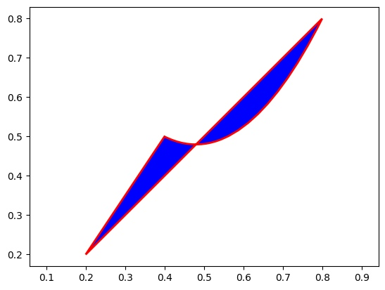
### Collection
#### Scatter - 散点图
`Scatter`必须输入
```
`x, y` :两个一维数组
```
支持输入单个下面的属性或者同`x，y`形状相同的数组
- `alpha`,`linewidths`,`marker`,`s`,`c` ,`linestyle`,`edgecolors`
- `edgecolors` : 支持`'face'`, `'none'`,本别表示同`face`或者不绘制
- 支持和点相关的所有参数


```Python
import numpy as np
import matplotlib.pyplot as plt

# 创建网格数据
x = np.linspace(0, 1, 10)
y = np.linspace(0, 3, 10)
plt.scatter(x,y,s = x*100,c = y,edgecolors='r',marker='p')
plt.show()
```


#### pcolormesh - 伪色彩图


`X`:二维数组,表示网格数据的 x 坐标。
`Y`:二维数组,表示网格数据的 y 坐标。
`C`:二维数组,表示网格数据的颜色值。
`cmap`:`str`,颜色映射,用于确定颜色值与颜色的映射关系。默认为 None,使用默认的颜色映射。
`vmin` 和 `vmax`:指定颜色值的范围,用于控制颜色填充的范围。默认为 None,自动根据数据的最小值和最大值确定范围。

```Python
import numpy as np
import matplotlib.pyplot as plt

# 创建网格数据
x = np.linspace(0, 1, 10)
y = np.linspace(0, 1, 10)
X, Y = np.meshgrid(x, y)
Z = np.random.rand(10, 10)  # 随机生成一个 10x10 的颜色值数组

# 绘制伪彩色图
a = plt.pcolormesh(X, Y, Z, cmap='viridis')

# 添加颜色刻度条
plt.colorbar()

# 显示图表
plt.show()
```
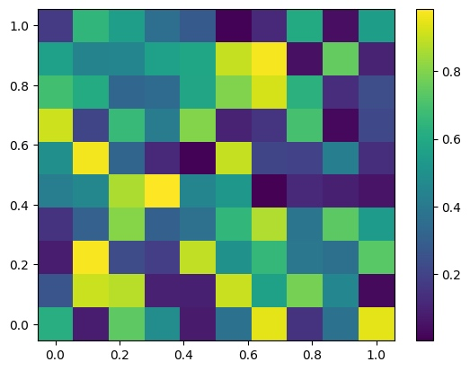
### 封装函数
下面是一些常用的针对添加画件的封装函数
```
annotate - Annotation
bar - Rectangle
errorbar - Line2D and Rectangle
fill - Polygon
hist - Rectangle
imshow - AxesImage
legend - Legend
plot - Line2D
scatter - PathCollection
text - Text
```
实际上`ax.plot(x,y)`等同于
```
from matplotlib.lines import Line2D
line = Line2D(x,y)
ax.add_artist(line)
```
当你手动添加画件后`Figure`和`Axes`并不会自动的调整显示,而上面的封装函数包含了对显示的调整当然你也可以主动启动调整函数
```
fig.tight_layout(): 调整图形中的子图、标签和边界的布局,以确保它们适合图形区域。
fig.subplots_adjust(): 手动调整子图的位置和间距

ax.relim(): 重新计算坐标轴限制,以适应添加的 Artist 对象。
ax.autoscale_view(): 自动调整坐标轴的视图,以适应添加的 Artist 对象。
ax.autoscale():
```
#### plot - Line2D
`plot`的封装还支持更多的功能,比如`fmt`,`data`,或者同时绘制两个`Line2D`
```
plot([x], y, [fmt], *, data=None, **kwargs)
plot([x], y, [fmt], [x2], y2, [fmt2], ..., **kwargs)
```
`format = '[marker][line][color]'`
```
plot(x, y, 'bo') #绘制蓝色线条圆圈标记
```

`x/y`是类型数组的数据,可以·和`data`联合起来支持`dict`、`pandas.DataFrame`
```
np.random.seed(19680801)  # seed the random number generator.
data = {'a': np.arange(50),
        'c': np.random.randint(0, 50, 50),
        'd': np.random.randn(50)}
data['b'] = data['a'] + 10 * np.random.randn(50)
data['d'] = np.abs(data['d']) * 100
ax.scatter('a', 'b', c='c', s='d', data=data)
```

#### imshow - AxesImage
```Python
import matplotlib.pyplot as plt
import matplotlib.image as mpimg

# 读取图像文件
image = mpimg.imread('path/to/image.jpg')

# 创建图形和坐标轴
fig, ax = plt.subplots()

# 在坐标轴上显示图像
img = ax.imshow(image)

# 显示图形界面
plt.show()
```
## 进阶玩法
### Cycler - 颜色循环器

`matplotlib`会自动使用`Cycler`为你绘制的画件赋予颜色
```
default_cycler = plt.rcParams['axes.prop_cycle']
# 输出默认样式属性
print(default_cycler)
```
你也可以创建你自己的Cycler
```Python
import matplotlib.pyplot as plt
from cycler import cycler

x = [0, 1, 2, 3, 4]
y1 = [0, 1, 0, 2, 1]
y2 = [1, 2, 1, 0, 1]

# 定义循环器
styles = cycler('color', ['red', 'green', 'blue']) + cycler('linestyle', ['-', '--', ':'])

fig, ax = plt.subplots()

# 应用循环器样式到线条
ax.plot(x, y1, label='Line 1', **next(styles))
ax.plot(x, y2, label='Line 2', **next(styles))

ax.legend()
plt.show()
```
或者修改配置
```
plt.rc('axes', prop_cycle=default_cycler)
```
### Simplyfy - 简化
### patheffects - 路径效果

前文提到,所有对象的底层对象`matplotlib.patches`是`Path`,那么他们都可以使用`path_effects`这个属性来调整显示效果。
```Python
import matplotlib.patheffects as path_effects

text = plt.text(0.5, 0.5, 'Hello path effects world!',
                path_effects=[path_effects.withSimplePatchShadow()])

plt.plot([0, 3, 2, 5], linewidth=5, color='blue',
         path_effects=[path_effects.SimpleLineShadow(),
                       path_effects.Normal(),path_effects.withTickedStroke()])
plt.show()
```


`AbstractPathEffect`是所有`PathEffect`的基类唯一的属性是
- `offset`:`(x,y)`表示偏移

#### PathPatchEffect - 基础样式
基础样式,可以任意设定,并且可以叠加
```Python
import numpy as np
import matplotlib.pyplot as plt
fig = plt.figure(figsize=(8.5, 1))
t = fig.text(0.02, 0.5, 'Hatch shadow', fontsize=75, weight=1000, va='center')
t.set_path_effects([
    path_effects.PathPatchEffect(
        offset=(4, -4), hatch='xxxx', facecolor='gray'),
    path_effects.PathPatchEffect(
        edgecolor='white', linewidth=1.1, facecolor='black')])
plt.show()
```

#### SimpleLineShadow - 阴影样式
适用于Line2D,如直线、曲线等
- `offset`:`(x,y)`表示偏移
- `shadow_color`:阴影颜色
- `alpha`:`float`,透明度
- `rho`:`float`,`shadow_color` 为 `None` 时,`rho` 参数可以用于调整 `rgbFace` 颜色的亮度或饱和度
#### SimplePatchShadow - 阴影样式
适用于路径对象,如矩形、圆形等,参数同`SimpleLineShadow`
#### Stroke - 重绘样式
接受`gc_kw`参数,相当于重新指定样式
#### Normal - 原始样式
绘制原始样式
#### TickedStroke - 刻度样式
添加刻度线
- offset
- angle:刻度线的角度,以度为单位。默认值为 45.0。
- length:刻度线的长度。默认值为 3。
- spacing:刻度线之间的间距。默认值为 5。
- length : 长度,默认为1.414
### transform 坐标变化

在matplotlib中有四种基本坐标,你可以使用前三者,使用转化函数转化为实际显示的像素坐标,转化函数还有一个invert的反向转化
|          |                  |                             | 转化函数     |
|----------|------------------|-----------------------------|:-------------|
| 数据坐标 | 按照x,y轴定位    | （12,12）                     | ax.transData |
| 相对坐标 | 按照相对大小定位 | （0.1,0.2）                   | ax.transAxes,subfigure.transSubfigure,fig.transFigure             |
| 物理坐标 | 按照实际尺寸定位 | （2/72,2/72）默认单位为（inch） |  fig.dpi_scale_trans            |
| 显示坐标 | 按照像素点定位   | （368,459）                   |              |

```Python
In [15]: ax.transData.transform((5, 0))
Out[15]: array([ 335.175,  247.   ])

In [16]: ax.transData.transform([(5, 0), (1, 2)])
Out[16]:
array([[ 335.175,  247.   ],
       [ 132.435,  642.2  ]])
       
In [41]: inv = ax.transData.inverted()
In [43]: inv.transform((335.175,  247.))
Out[43]: array([ 5.,  0.])
```
```Python
x = np.arange(0, 10, 0.005)
y = np.exp(-x/2.) * np.sin(2*np.pi*x)

fig, ax = plt.subplots()
ax.plot(x, y)
ax.set_xlim(0, 10)
ax.set_ylim(-1, 1)

xdata, ydata = 5, 0
# This computing the transform now, if anything
# (figure size, dpi, axes placement, data limits, scales..)
# changes re-calling transform will get a different value.
xdisplay, ydisplay = ax.transData.transform((xdata, ydata))

bbox = dict(boxstyle="round", fc="0.8")
arrowprops = dict(
    arrowstyle="->",
    connectionstyle="angle,angleA=0,angleB=90,rad=10")

offset = 72
ax.annotate(f'data = ({xdata:.1f}, {ydata:.1f})',
            (xdata, ydata), xytext=(-2*offset, offset), textcoords='offset points',
            bbox=bbox, arrowprops=arrowprops)

disp = ax.annotate(f'display = ({xdisplay:.1f}, {ydisplay:.1f})',
                   (xdisplay, ydisplay), xytext=(0.5*offset, -offset),
                   xycoords='figure pixels',
                   textcoords='offset points',
                   bbox=bbox, arrowprops=arrowprops)

plt.show()
```
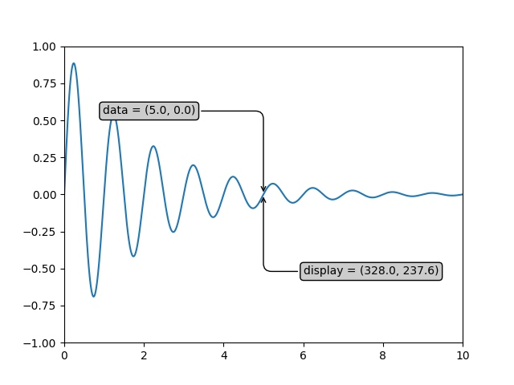
#### Blended transformations - 混合坐标变化
通过`transforms.blended_transform_factory`创建混合变化,`x`坐标被解析为`ax.transData`,`y`坐标被解析为`ax.transAxes`,比如起点`（1,0）`即为`x`坐标为`1`,`y`位于`0%`处,`x`宽为坐标轴长`1`,`y`为整个区域`100%`
```Python
import matplotlib.transforms as transforms
import numpy as np
import matplotlib.pyplot as plt
fig, ax = plt.subplots()

trans = transforms.blended_transform_factory(
    ax.transData, ax.transAxes)
rect = mpatches.Rectangle((1, 0), width=1, height=1, transform=trans,
                          color='yellow', alpha=0.5)
ax.add_patch(rect)
ax.set_ylim(2,800)
ax.set_xlim(0,3)
plt.show()
```

实际上x,y坐标的解析就是混合坐标变化
```
ax.get_xaxis_transform(),
ax.get_yaxis_transform()
```
#### ScaledTranslation - 偏移坐标变换
```
class matplotlib.transforms.ScaledTranslation(xt, yt, scale_trans,...)
```
下面的圆首先被`fig.dpi_scale_trans`转化,圆心在`（0,0）`,然后偏移到`（0.2,0.7）`,注意顺序很重要
```Python
import numpy as np
import matplotlib.pyplot as plt
fig, ax = plt.subplots()
xdata, ydata = (0.2, 0.7), (0.5, 0.5)
ax.plot(xdata, ydata, "o")
ax.set_xlim((0, 1))

trans = (fig.dpi_scale_trans +
         transforms.ScaledTranslation(xdata[0], ydata[0], ax.transData))

# plot an ellipse around the point that is 150 x 130 points in diameter...
circle = mpatches.Ellipse((0, 0), 150/72, 130/72, angle=40,
                          fill=None, transform=trans)
ax.add_patch(circle)
plt.show()
```

还可以创建阴影
```Python
import numpy as np
import matplotlib.pyplot as plt
fig, ax = plt.subplots()

# make a simple sine wave
x = np.arange(0., 2., 0.01)
y = np.sin(2*np.pi*x)
line, = ax.plot(x, y, lw=3, color='blue')

# shift the object over 2 points, and down 2 points
dx, dy = 2/72., -2/72.
offset = transforms.ScaledTranslation(dx, dy, fig.dpi_scale_trans)
shadow_transform = ax.transData + offset

# now plot the same data with our offset transform;
# use the zorder to make sure we are below the line
ax.plot(x, y, lw=3, color='gray',
        transform=shadow_transform,
        zorder=0.5*line.get_zorder())

ax.set_title('creating a shadow effect with an offset transform')
plt.show()
```
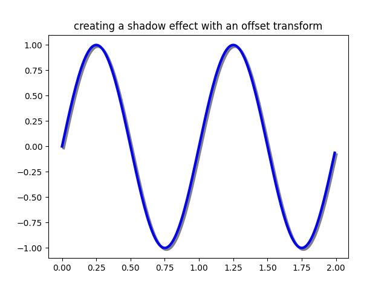
### 后端配置
后端分为内置后端、拓展后端，静态后端、交互式后端。拓展后端的名称为
类似`'module://matplotlib_inline.backend_inline'`
```
#查看后端
plt.get_backend()
#修改后端
plt.rcParams["backend"] = 'agg1
matplotlib.use('qtagg')
修改配置文件
```
默认支持的静态后端
```
['agg', 'cairo', 'pdf', 'pgf', 'ps', 'svg', 'template']
```
默认支持的交互式后端
```
['GTK3Agg', 'GTK3Cairo', 'GTK4Agg', 'GTK4Cairo', 'MacOSX', 'nbAgg', 'QtAgg', 'QtCairo', 'Qt5Agg', 'Qt5Cairo', 'TkAgg', 'TkCairo', 'WebAgg', 'WX', 'WXAgg', 'WXCairo']
```


#### jupyter拓展后端
jupyter有三个拓展后端，第一个默认，为静态后端，后两个交互式后端需要安装ipympl
```
%matplotlib inline(默认）-'module://matplotlib_inline.backend_inline'
%matplotlib ipympl-'module://ipympl.backend_nbagg'
%matplotlib widget-'module://ipympl.backend_nbagg'
```
如果想在ipynb中使用交互式后端，安装ipympl
```
pip install ipympl
conda install ipympl -c conda-forge
```

## 动态绘图

### Animation - 动画
`Animation`提供两个函数`FuncAnimation`和`ArtistAnimation`，前者按照给定函数不断改变`Artist`的数据，后者按照给定的`Artist`列表进行迭代。

#### FuncAnimation
FuncAnimation必须指定的参数如下
- fig：画布
- func：更新函数
- frames：总帧数
- interval：帧间隔

支持的参数如下：repeat：bool，repeat_delay:int

```Python
import numpy as np
import matplotlib.pyplot as plt
fig, ax = plt.subplots()
t = np.linspace(0, 3, 40)
g = -9.81
v0 = 12
z = g * t**2 / 2 + v0 * t

v02 = 5
z2 = g * t**2 / 2 + v02 * t

scat = ax.scatter(t[0], z[0], c="b", s=5, label=f'v0 = {v0} m/s')
line2 = ax.plot(t[0], z2[0], label=f'v0 = {v02} m/s')[0]
ax.set(xlim=[0, 3], ylim=[-4, 10], xlabel='Time [s]', ylabel='Z [m]')
ax.legend()


def update(frame):
    # for each frame, update the data stored on each artist.
    x = t[:frame]
    y = z[:frame]
    # update the scatter plot:
    data = np.stack([x, y]).T
    scat.set_offsets(data)
    # update the line plot:
    line2.set_xdata(t[:frame])
    line2.set_ydata(z2[:frame])
    return (scat, line2)


ani = animation.FuncAnimation(fig=fig, func=update, frames=40, interval=30)
plt.show()
```
<iframe  
height=400 
width=60% 
src="media/func.mp4"  
frameborder=0  
allowfullscreen>
</iframe>

#### ArtistAnimation
```Python
import numpy as np
import matplotlib.pyplot as plt
fig, ax = plt.subplots()
rng = np.random.default_rng(19680801)
data = np.array([20, 20, 20, 20])
x = np.array([1, 2, 3, 4])

artists = []
colors = ['tab:blue', 'tab:red', 'tab:green', 'tab:purple']
for i in range(20):
    data += rng.integers(low=0, high=10, size=data.shape)
    container = ax.barh(x, data, color=colors)
    artists.append(container)


ani = animation.ArtistAnimation(fig=fig, artists=artists, interval=400)
plt.show()
```
#### writer
支持图片、HTML、视频、Gif等等
```Python
Pillow writers:
ani.save(filename="/tmp/pillow_example.gif", writer="pillow")
ani.save(filename="/tmp/pillow_example.apng", writer="pillow")

HTML writers:
ani.save(filename="/tmp/html_example.html", writer="html")
ani.save(filename="/tmp/html_example.htm", writer="html")
ani.save(filename="/tmp/html_example.png", writer="html")

FFMpegWriter:
ani.save(filename="/tmp/ffmpeg_example.mkv", writer="ffmpeg")
ani.save(filename="/tmp/ffmpeg_example.mp4", writer="ffmpeg")
ani.save(filename="/tmp/ffmpeg_example.mjpeg", writer="ffmpeg")

Imagemagick writers:
ani.save(filename="/tmp/imagemagick_example.gif", writer="imagemagick")
ani.save(filename="/tmp/imagemagick_example.webp", writer="imagemagick")
ani.save(filename="apng:/tmp/imagemagick_example.apng",
         writer="imagemagick", extra_args=["-quality", "100"])
 ```
首先先建立一个基本概念,交互模式与非交互模式
`pyplot.ion`:打开交互模式
`pyplot.ioff`:关闭交换模式
`pyplot.isinteractive`:查看是否为交互模式
`pyplot.show`:显示所有绘图
`pyplot.pause`:显示一段时间
## 事件管理
见[文章](https://cloud.tencent.com/developer/article/2183032)
### 
ax.cla()
fig.clf() 
ax.cla()
fig.canvas.draw_idle()
fig.canvas.flush_events()