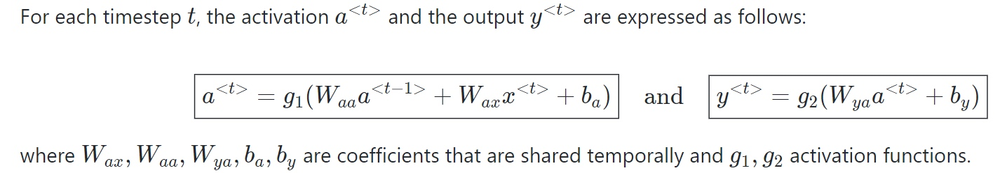

[Transformer精讲](https://adaning.github.io/posts/6744.html)

### RNN
标准神经网络中的所有输入和输出都是相互独立的，但是在某些情况下，例如在预测短语的下一个单词时，前面的单词是必要的，因此必须记住前面的单词。结果，RNN 应运而生，它使用隐藏层来克服这个问题。RNN 最重要的组成部分是隐藏状态，它记住有关序列的特定信息。

RNN 有一个内存，用于存储有关计算的所有信息。它对每个输入采用相同的设置，因为它通过在所有输入或隐藏层上执行相同的任务来产生相同的结果。

RNN通常会用来一对多、多对多、多对一对任务。
#### [Simple RNN]((https://www.analyticsvidhya.com/blog/2022/03/a-brief-overview-of-recurrent-neural-networks-rnn/))
本节点的输出同时取决于当前的输入和隐藏状态。

ElmanRNN将上一次的隐藏层状态作为下一次的隐藏状态，JordanRNN将上一次的输出作为下一次的隐藏状态,下面以Elman为例说明隐藏状态如何起作用

这样的RNN会面临两个问题：
（1）梯度消失：LSTM可以解决梯度消失的问题（记忆不会因为一次输出为0就被洗掉）
（2）梯度爆炸：因为某一个状态可能累计在隐藏状态中导致不断累积，可以通过Clipping解决

#### LSTM
LSTM的核心就是记忆单元和输入门、输出门、遗忘门，主要步骤如下：
（1）记忆单元遗忘：上一个状态记忆单元的输出\[h_{t-1}\]

（2）记忆如何更新：
（3）记忆如何输出：

#### GRU

#### Bidrectional RNN

#### 拓展
Sequence to Sequence AutoDecoder

