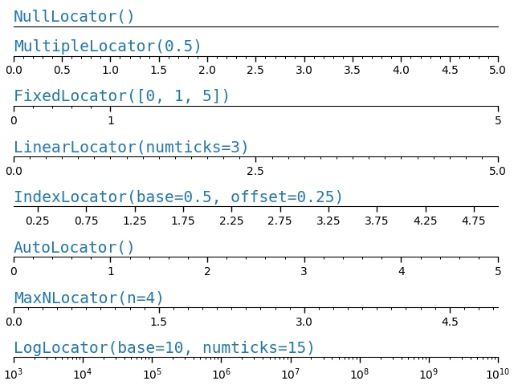
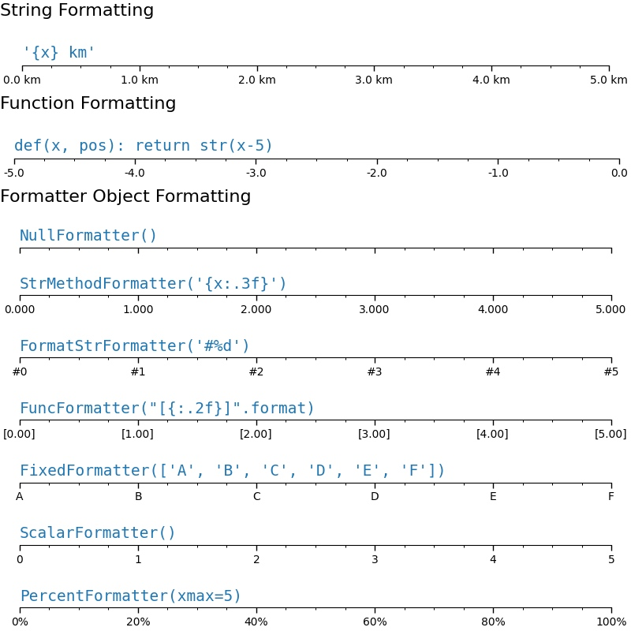
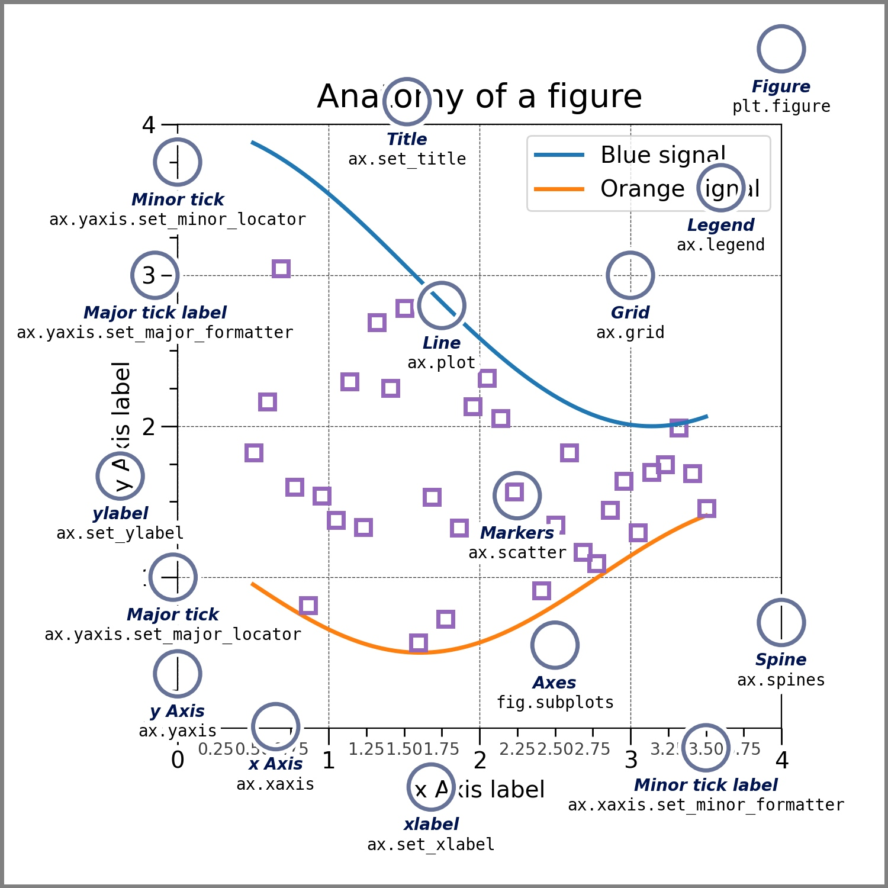

# 
这里是一份[教程](https://matplotlib.org/stable/tutorials/index.html)

## 基本概念
`Figure`:画布，包含一个或者多个`Axes`,也可包含子Fiugre
`Axes`:画图区，附着于`Figure`的`Artist`，包含两个或者三个`Axis`
`Axis`:坐标轴
`Artist`:基本对象，包括`Text` , `Line2D` ,`collections` , `Patch`等等（甚至包括`Figure`, `Axes`, `Axis`）

### Figure
`Figure`具有如下相关的属性
```
class Figure(FigureBase):
    def __init__(
        self,
        figsize: tuple[float, float] = ...,
        dpi: float = ...,
        facecolor: Color = ...,
        edgecolor: Color = ...,
        linewidth: float = ...,
        frameon: bool = ...,
        subplotpars: SubplotParams = ...,
        tight_layout: bool | dict = ...,
        constrained_layout: bool = ...,
        *,
        layout: LayoutEngine
        | Literal["constrained", "compressed", "tight"]
        | None = ...,
        **kwargs
    ) -> None: ...
    
figsize：一个包含两个浮点数的元组，用于指定图形的尺寸（宽度和高度）。
dpi：一个浮点数，表示图形的分辨率（每英寸点数）。
facecolor：一个颜色对象，表示图形的背景色。
edgecolor：一个颜色对象，表示图形的边框颜色。
linewidth：一个浮点数，表示图形边框的线宽。
frameon：一个布尔值，指示是否绘制图形的边框。
subplotpars：一个 SubplotParams 对象，用于指定子图的参数。
tight_layout：一个布尔值或字典，用于控制图形的紧凑布局。
constrained_layout：一个布尔值，指示是否启用约束布局。
layout：一个布局引擎对象、字符串字面量 "constrained"、"compressed"、"tight" 或 None。用于指定图形的布局方式。
```

### Axes
`Axes`具有如下的属性
```
class Axes(_AxesBase):

    dataLim: Bbox
    viewLim: Bbox
    figure: Figure
    transAxes: BboxTransformTo
    transData: Transform
    xaxis: XAxis
    yaxis: YAxis
    spines: Spines
    fmt_xdata: None | Formatter = ...
    fmt_ydata: None | Formatter = ...
    cursor_to_use: Cursors = ...
    
dataLim：一个 Bbox 对象，表示数据的边界框。
viewLim：一个 Bbox 对象，表示视图的边界框。
figure：一个 Figure 对象，表示图形对象。
transAxes：一个 BboxTransformTo 对象，表示坐标系转换到轴坐标系的转换。
transData：一个 Transform 对象，表示数据坐标系到轴坐标系的转换。
xaxis：一个 XAxis 对象，表示 x 轴对象。
yaxis：一个 YAxis 对象，表示 y 轴对象。
spines：一个 Spines 对象，表示坐标轴的脊柱线。
fmt_xdata：一个 None 或 Formatter 对象，用于格式化 x 轴的数据。
fmt_ydata：一个 None 或 Formatter 对象，用于格式化 y 轴的数据。
cursor_to_use：一个 Cursors 枚举类型对象，表示要使用的光标。
```

#### spines
`spines`有四条,通过`ax.spines.__dict__`查看
```
{'_dict': {'left': <matplotlib.spines.Spine at 0x13dc317b0>,
  'right': <matplotlib.spines.Spine at 0x13dc316c0>,
  'bottom': <matplotlib.spines.Spine at 0x13dc315d0>,
  'top': <matplotlib.spines.Spine at 0x13dc314e0>}}
```
`spines`属性表示坐标轴的脊柱线,脊柱线是沿着坐标轴延伸的线条,你可以对每个坐标轴的脊柱线进行设置，包括线的样式、颜色、位置等。
```
spine = ax.spines['bottom']
spine.set_linewidth(width)：设置脊柱线的宽度。
spine.set_linestyle():
spine.set_color(color)：设置脊柱线的颜色。
spine.set_position(position)：设置脊柱线的位置，可以是 "zero"（交叉于另一个轴的零刻度位置）、"outward"（向外延伸）、"axes"（相对于数据区域的百分比位置）或具体的数值。
spine.set_visible(visibility)：设置脊柱线的可见性。
spine.set_bounds(lower, upper)：设置脊柱线的数据区间范围。
```


#### Axis
`XAxi/YAxi`是坐标轴对象，`XAxis/YAxis`是`Axis`的封装，`Axis`的属性如下

```
class Axis(Artist):

    isDefault_label: bool
    axes: Axes
    major: Ticker
    minor: Ticker
    callbacks: CallbackRegistry
    label: Text
    labelpad: float = 4
    offsetText: Text
    pickradius: float

    OFFSETTEXTPAD: int = ...
```
可以通过下面的方式设置Axis
```
ax.set(xticks=[], yticks=[])
ax.axis([55, 175, 0, 0.03])
axs.set_yscale('log')
ax.set_ylim(-2, 2)
ax.set_xticks(np.arange(0, 100, 30), ['zero', '30', 'sixty', '90'])
ax.set_yticks([-1.5, 0, 1.5])  # note that we don't need to specify labels
ax.tick_params(axis='x', labelcolor='red', labelsize=14)
ax.set_aspect(3) #设置横纵比
ax.locator_params(nbins=3)  # 设置刻度的数量为3
```
##### Ticker
`Axis`具有两个`Ticker`，`major`和`minor`,分别表示主刻度和副刻度。可以使用`ax.tick_params`下面的函数来设置属性
```
ax.tick_params(right=True, left=False, axis='y', color='r', length=16,grid_color='none')
ax.tick_params(axis='x', color='m', length=4, direction='in', width=4,labelcolor='g', grid_color='b')
```
支持修改下面的属性
```
length
colors
labelsize (fontsize)
labelcolor (color of the label)
labelrotation
labelbottom, labeltop, labelleft, labelright
grid_color
grid_alpha
grid_linewidth
grid_linestyle
```

`Ticker`有两个属性`locator`和`formatter`，分别管理位置信息和格式信息,可以使用下面的方法来设置。
```
set_major_locator() 
set_minor_locator()
set_major_formatter()
set_minor_formatter()
```    


###### Locators
```
def setup(ax, title):
    """Set up common parameters for the Axes in the example."""
    # only show the bottom spine
    ax.yaxis.set_major_locator(ticker.NullLocator())
    ax.spines[['left', 'right', 'top']].set_visible(False)

    ax.xaxis.set_ticks_position('bottom')
    ax.tick_params(which='major', width=1.00, length=5)
    ax.tick_params(which='minor', width=0.75, length=2.5)
    ax.set_xlim(0, 5)
    ax.set_ylim(0, 1)
    ax.text(0.0, 0.2, title, transform=ax.transAxes,
            fontsize=14, fontname='Monospace', color='tab:blue')


fig, axs = plt.subplots(8, 1, layout='constrained')

# Null Locator
setup(axs[0], title="NullLocator()")
axs[0].xaxis.set_major_locator(ticker.NullLocator())
axs[0].xaxis.set_minor_locator(ticker.NullLocator())

# Multiple Locator
setup(axs[1], title="MultipleLocator(0.5)")
axs[1].xaxis.set_major_locator(ticker.MultipleLocator(0.5))
axs[1].xaxis.set_minor_locator(ticker.MultipleLocator(0.1))

# Fixed Locator
setup(axs[2], title="FixedLocator([0, 1, 5])")
axs[2].xaxis.set_major_locator(ticker.FixedLocator([0, 1, 5]))
axs[2].xaxis.set_minor_locator(ticker.FixedLocator(np.linspace(0.2, 0.8, 4)))

# Linear Locator
setup(axs[3], title="LinearLocator(numticks=3)")
axs[3].xaxis.set_major_locator(ticker.LinearLocator(3))
axs[3].xaxis.set_minor_locator(ticker.LinearLocator(31))

# Index Locator
setup(axs[4], title="IndexLocator(base=0.5, offset=0.25)")
axs[4].plot(range(0, 5), [0]*5, color='white')
axs[4].xaxis.set_major_locator(ticker.IndexLocator(base=0.5, offset=0.25))

# Auto Locator
setup(axs[5], title="AutoLocator()")
axs[5].xaxis.set_major_locator(ticker.AutoLocator())
axs[5].xaxis.set_minor_locator(ticker.AutoMinorLocator())

# MaxN Locator
setup(axs[6], title="MaxNLocator(n=4)")
axs[6].xaxis.set_major_locator(ticker.MaxNLocator(4))
axs[6].xaxis.set_minor_locator(ticker.MaxNLocator(40))

# Log Locator
setup(axs[7], title="LogLocator(base=10, numticks=15)")
axs[7].set_xlim(10**3, 10**10)
axs[7].set_xscale('log')
axs[7].xaxis.set_major_locator(ticker.LogLocator(base=10, numticks=15))
plt.show()
```


###### Formator

```
def setup(ax, title):
    """Set up common parameters for the Axes in the example."""
    # only show the bottom spine
    ax.yaxis.set_major_locator(ticker.NullLocator())
    ax.spines[['left', 'right', 'top']].set_visible(False)

    # define tick positions
    ax.xaxis.set_major_locator(ticker.MultipleLocator(1.00))
    ax.xaxis.set_minor_locator(ticker.MultipleLocator(0.25))

    ax.xaxis.set_ticks_position('bottom')
    ax.tick_params(which='major', width=1.00, length=5)
    ax.tick_params(which='minor', width=0.75, length=2.5, labelsize=10)
    ax.set_xlim(0, 5)
    ax.set_ylim(0, 1)
    ax.text(0.0, 0.2, title, transform=ax.transAxes,
            fontsize=14, fontname='Monospace', color='tab:blue')


fig = plt.figure(figsize=(8, 8), layout='constrained')
fig0, fig1, fig2 = fig.subfigures(3, height_ratios=[1.5, 1.5, 7.5])

fig0.suptitle('String Formatting', fontsize=16, x=0, ha='left')
ax0 = fig0.subplots()

setup(ax0, title="'{x} km'")
ax0.xaxis.set_major_formatter('{x} km')

fig1.suptitle('Function Formatting', fontsize=16, x=0, ha='left')
ax1 = fig1.subplots()

setup(ax1, title="def(x, pos): return str(x-5)")
ax1.xaxis.set_major_formatter(lambda x, pos: str(x-5))

fig2.suptitle('Formatter Object Formatting', fontsize=16, x=0, ha='left')
axs2 = fig2.subplots(7, 1)

setup(axs2[0], title="NullFormatter()")
axs2[0].xaxis.set_major_formatter(ticker.NullFormatter())

setup(axs2[1], title="StrMethodFormatter('{x:.3f}')")
axs2[1].xaxis.set_major_formatter(ticker.StrMethodFormatter("{x:.3f}"))

setup(axs2[2], title="FormatStrFormatter('#%d')")
axs2[2].xaxis.set_major_formatter(ticker.FormatStrFormatter("#%d"))


def fmt_two_digits(x, pos):
    return f'[{x:.2f}]'


setup(axs2[3], title='FuncFormatter("[{:.2f}]".format)')
axs2[3].xaxis.set_major_formatter(ticker.FuncFormatter(fmt_two_digits))

setup(axs2[4], title="FixedFormatter(['A', 'B', 'C', 'D', 'E', 'F'])")
# FixedFormatter should only be used together with FixedLocator.
# Otherwise, one cannot be sure where the labels will end up.
positions = [0, 1, 2, 3, 4, 5]
labels = ['A', 'B', 'C', 'D', 'E', 'F']
axs2[4].xaxis.set_major_locator(ticker.FixedLocator(positions))
axs2[4].xaxis.set_major_formatter(ticker.FixedFormatter(labels))

setup(axs2[5], title="ScalarFormatter()")
axs2[5].xaxis.set_major_formatter(ticker.ScalarFormatter(useMathText=True))

setup(axs2[6], title="PercentFormatter(xmax=5)")
axs2[6].xaxis.set_major_formatter(ticker.PercentFormatter(xmax=5))
```




##### 添加新的轴
functions有两个，作为原始数据到新坐标轴数据和与之相反方向的转化
```
ax1 = ax.secondary_xaxis('top',functions=(lambda x:x+1,lambda x: x-2))
ax1.set_xlabel("x+1")
```

### Artist

成对数据

plot, scatter, bar, step,

数组对象

pcolormesh, contour, quiver, streamplot, imshow

统计分布

hist,,,,,,, errorbar_ hist2d_ pie_ boxplot_violinplot

不规则网格数据

tricontour,tripcolor
#### Line2D
`plot`的声明如下，注意返回的是元组
```
plot([x], y, [fmt], *, data=None, **kwargs)
plot([x], y, [fmt], [x2], y2, [fmt2], ..., **kwargs)
```
`x/y`是类型数组的数据,可以·和`data`联合起来支持`dict`、`pandas.DataFrame`
```
np.random.seed(19680801)  # seed the random number generator.
data = {'a': np.arange(50),
        'c': np.random.randint(0, 50, 50),
        'd': np.random.randn(50)}
data['b'] = data['a'] + 10 * np.random.randn(50)
data['d'] = np.abs(data['d']) * 100
ax.scatter('a', 'b', c='c', s='d', data=data)
```
`format = '[marker][line][color]'`的设置如下
```
Markers
=============   ===============================
character       description
=============   ===============================
``'.'``         point marker
``','``         pixel marker
``'o'``         circle marker
``'v'``         triangle_down marker
``'^'``         triangle_up marker
``'<'``         triangle_left marker
``'>'``         triangle_right marker
``'1'``         tri_down marker
``'2'``         tri_up marker
``'3'``         tri_left marker
``'4'``         tri_right marker
``'8'``         octagon marker
``'s'``         square marker
``'p'``         pentagon marker
``'P'``         plus (filled) marker
``'*'``         star marker
``'h'``         hexagon1 marker
``'H'``         hexagon2 marker
``'+'``         plus marker
``'x'``         x marker
``'X'``         x (filled) marker
``'D'``         diamond marker
``'d'``         thin_diamond marker
``'|'``         vline marker
``'_'``         hline marker
=============   ===============================

Line Styles

=============    ===============================
character        description
=============    ===============================
``'-'``          solid line style
``'--'``         dashed line style
``'-.'``         dash-dot line style
``':'``          dotted line style
=============    ===============================

Colors

=============    ===============================
character        color
=============    ===============================
``'b'/C0``          blue
``'g'/C1``          green
``'r'/C2``          red
``'c'/C3``          cyan
``'m'/C4``          magenta
``'y'/C5``          yellow
``'k'/C6``          black
``'w'/C7``          white

=============    ===============================
单独设置color=时支持(``'green'``)(``'#008000'``).
```

`kwargs`包括
```
label
color
size
marker
markersize
linestyle
linewdith

```
可以单独设置format的每一项
```
plt.plot(...,
    marker='o',
    markersize=12,
    color="#00800",
    linestyle="-",
    linewidth="2
    ...)

linestyle=Literal['-', 'solid', '--', 'dashed', '-.', 'dashdot', ':', 'dotted', 'None', 'none', ' ', '']
color="#00800",(0.5,0.5,0.5),"red","g"
```
示例
```
plot([1, 2, 3], [1, 2, 3], 'go-', label='line 1', linewidth=2)
plot(x1, y1, 'g^', x2, y2, 'g-')
```


```
X, Y = np.meshgrid(np.linspace(-3, 3, 128), np.linspace(-3, 3, 128))
Z = (1 - X/2 + X**5 + Y**3) * np.exp(-X**2 - Y**2)

fig, axs = plt.subplots(2, 2, layout='constrained')
pc = axs[0, 0].pcolormesh(X, Y, Z, vmin=-1, vmax=1, cmap='RdBu_r')
fig.colorbar(pc, ax=axs[0, 0])
axs[0, 0].set_title('pcolormesh()')

co = axs[0, 1].contourf(X, Y, Z, levels=np.linspace(-1.25, 1.25, 11))
fig.colorbar(co, ax=axs[0, 1])
axs[0, 1].set_title('contourf()')

pc = axs[1, 0].imshow(Z**2 * 100, cmap='plasma',
                          norm=mpl.colors.LogNorm(vmin=0.01, vmax=100))
fig.colorbar(pc, ax=axs[1, 0], extend='both')
axs[1, 0].set_title('imshow() with LogNorm()')

pc = axs[1, 1].scatter(data1, data2, c=data3, cmap='RdBu_r')
fig.colorbar(pc, ax=axs[1, 1], extend='both')
axs[1, 1].set_title('scatter()')

```
#### Text
`label`是`Text`对象，具有如下属性，可以通过`Text.set_label()/set_color()`等方式设置
```
def __init__(self,
    x=0,
    y=0, 
    text='',
    color=None,           # defaults to rc params
    verticalalignment='baseline',
    horizontalalignment='left',
    multialignment=None,
    fontproperties=None,  # defaults to FontProperties()
    rotation=None,
    linespacing=None,
    rotation_mode=None,
    usetex=None,          # defaults to rcParams['text.usetex']
    wrap=False,
    transform_rotates_text=False,
    *,
    parse_math=None,    # defaults to rcParams['text.parse_math']
    **kwargs
```
注意:下面的函数封装修改的均为同一个`Text`对象，目前未发现`Axis`，`Axes`，`Figure`的`*.set_label()/*.get_label()`函数与`*._label`属性的用途。
```
ax.set_xlabel("fsd")
ax.xaxis.label.set_text()
ax.xaxis.set_label_text()
```
##### 添加`text`对象示例
```
ax.text(75, .025, r'$\mu=115,\ \sigma=15$')
ax.annotate('local max', xy=(2, 1), xytext=(3, 1.5),arrowprops=dict(facecolor='black', shrink=0.05))

ax.annotate(f'axs[{row}, {col}]', (0.5, 0.5),transform=axs[row, col].transAxes,ha='center', va='center', fontsize=18,color='darkgrey')
```


#### colorbar
不使用任何布局的colorbar会挤占空间导致不对齐

使用constraint布局可以解决简单情况下的不对齐

使用inset_axes可以解决大部分情况下的不对齐
```
fig, axs = plt.subplots(2, 2, layout='constrained')
cmaps = ['RdBu_r', 'viridis']
for col in range(2):
    for row in range(2):
        ax = axs[row, col]
        pcm = ax.pcolormesh(np.random.random((20, 20)) * (col + 1),
                            cmap=cmaps[col])
        if col == 0:
            ax.set_aspect(2)
        else:
            ax.set_aspect(1/2)
        if row == 1:
            cax = ax.inset_axes([1.04, 0.2, 0.05, 0.6])
            fig.colorbar(pcm, cax=cax)
```


## 进阶用法

### 创建画布
`matplotlib`
#### Figure
```
# 空白Figure
fig = plt.figure()
ax = fig.add_ax((left,bottom,width,height) 
# 带2x2网格Axes的Figure
fig, axs = plt.subplots(2, 2, layout='constrained')
#Figure子图
figL, figR = fig.subfigures(1, 2)
# mosaic画图
fig, axs = plt.subplot_mosaic([['left', 'right_top'],['left','right_bottom']])
```
#### mosaic
```
axd = plt.figure(layout="constrained").subplot_mosaic(
    """
    .a.
    bAc
    .d.
    """,
    # set the height ratios between the rows
    height_ratios=[1, 3.5, 1],
    # set the width ratios between the columns
    width_ratios=[1, 3.5, 1],
)
```
```

```

#### GridSpec
使用`Grid`传参数给`fig.add_subplot`
```
fig = plt.figure(figsize=(5.5, 3.5), layout="constrained")
spec = fig.add_gridspec(ncols=2, nrows=2)

ax0 = fig.add_subplot(spec[0, 0])
annotate_axes(ax0, 'ax0')

ax1 = fig.add_subplot(spec[0, 1])
annotate_axes(ax1, 'ax1')

ax2 = fig.add_subplot(spec[1, 0])
annotate_axes(ax2, 'ax2')

ax3 = fig.add_subplot(spec[1, 1])
annotate_axes(ax3, 'ax3')

fig.suptitle('Manually added subplots using add_gridspec')
```
使用跨越`Grid`
```
fig = plt.figure(layout=None, facecolor='lightblue')
gs = fig.add_gridspec(nrows=3, ncols=3, left=0.05, right=1,
                      hspace=0.5, wspace=0.5)
ax0 = fig.add_subplot(gs[:-1, :])
ax1 = fig.add_subplot(gs[-1, :-1])
ax2 = fig.add_subplot(gs[-1, -1])
fig.suptitle('Manual gridspec with right=0.75')
```
绘制子`Grid`
```
fig = plt.figure(layout="constrained")
gs0 = fig.add_gridspec(1, 2)

gs00 = gs0[0].subgridspec(2, 2)
gs01 = gs0[1].subgridspec(3, 1)

for a in range(2):
    for b in range(2):
        ax = fig.add_subplot(gs00[a, b])
        annotate_axes(ax, f'axLeft[{a}, {b}]', fontsize=10)
        if a == 1 and b == 1:
            ax.set_xlabel('xlabel')
for a in range(3):
    ax = fig.add_subplot(gs01[a])
    annotate_axes(ax, f'axRight[{a}, {b}]')
    if a == 2:
        ax.set_ylabel('ylabel')

fig.suptitle('nested gridspecs')
```
根据`Grid`直接生成`subplot`
```
def squiggle_xy(a, b, c, d, i=np.arange(0.0, 2*np.pi, 0.05)):
    return np.sin(i*a)*np.cos(i*b), np.sin(i*c)*np.cos(i*d)

fig = plt.figure(figsize=(8, 8), layout='constrained')
outer_grid = fig.add_gridspec(4, 4, wspace=0, hspace=0)

for a in range(4):
    for b in range(4):
        # gridspec inside gridspec
        inner_grid = outer_grid[a, b].subgridspec(3, 3, wspace=0, hspace=0)
        axs = inner_grid.subplots()  # Create all subplots for the inner grid.
        for (c, d), ax in np.ndenumerate(axs):
            ax.plot(*squiggle_xy(a + 1, b + 1, c + 1, d + 1))
            ax.set(xticks=[], yticks=[])

# show only the outside spines
for ax in fig.get_axes():
    ss = ax.get_subplotspec()
    ax.spines.top.set_visible(ss.is_first_row())
    ax.spines.bottom.set_visible(ss.is_last_row())
    ax.spines.left.set_visible(ss.is_first_col())
    ax.spines.right.set_visible(ss.is_last_col())

plt.show()
```
传递为`gridspec_kw`参数
```
axd = fig.subplot_mosaic(
    [["A","B"]["C","D"]],
    gridspec_kw={
        "bottom": 0.05, # 位置参数
        "top": 0.75, # 位置参数
        "left": 0.6, # 位置参数
        "right": 0.95, # 位置参数
        "wspace": 0.5, # 子图水平间距
        "hspace": 0.5, # 子图垂直间距
        "width_ratios":[1.4, 1],  #子图宽度比
        "height_ratios":[1, 2] #子图高度比
    },
)
```

```
axd = plt.figure(layout="constrained").subplot_mosaic(
    "AB", subplot_kw={"projection": "polar"}
)
```
```
fig, axd = plt.subplot_mosaic(
    "AB;CD",
    per_subplot_kw={
        "A": {"projection": "polar"},
        ("C", "D"): {"xscale": "log"}
    },
)
```

#### LayoutEngine
fig有三种自动布局引擎"constrained", "compressed", "tight"

```
class TightLayoutEngine(LayoutEngine):
    ...
    def __init__(self, *, pad=1.08, h_pad=None, w_pad=None,
                 rect=(0, 0, 1, 1), **kwargs)
pad：一个浮点数，表示子图与图形边界之间的间距。默认值为 1.08。

h_pad 和 w_pad：两个浮点数，分别表示垂直方向和水平方向上子图之间的间距。它们用于调整子图之间的间距以避免重叠和裁剪。默认情况下，它们的值为 None，表示使用默认的间距。

rect：一个四元组，表示整个图形区域的矩形范围。默认值为 (0, 0, 1, 1)，表示整个图形区域。
```

plt.subplots(layout="constrained")
plt.rcParams['figure.constrained_layout.use'] = True
fig.get_layout_engine().set(w_pad=4 / 72, h_pad=4 / 72, hspace=0,
                            wspace=0)

### 调整布局

#### margin

可以设置和查看`margin`，负的`margin`会导致图像被覆盖
```
ax.margins() -> (0.05, 0.05)
ax.margins(0.2, 0.2)
ax.margins(y=-0.2)
```
有的`Artist`没有`margin`,这是因为它使用了`use_sticky_edges`
```
xx, yy = np.meshgrid(x, x)
zz = np.sinc(np.sqrt((xx - 1)**2 + (yy - 1)**2))
fig, ax = plt.subplots(ncols=3, figsize=(16, 10))
ax[0].imshow(zz)
ax[0].margins(0.2)
ax[0].set_title("default use_sticky_edges\nmargins(0.2)")
ax[1].imshow(zz)
ax[1].margins(0.2)
ax[1].use_sticky_edges = False
ax[1].set_title("use_sticky_edges=False\nmargins(0.2)")
ax[2].imshow(zz)
ax[2].margins(-0.2)
ax[2].set_title("default use_sticky_edges\nmargins(-0.2)")
```
#### autoscale
一般情况下ax会自动调用下面的函数，但是当你手动设置了ax的尺度，比如ax.xlim时则不会调用下面的函数`ax.autoscale()`，但是当绘制collections时必须手动调用`ax.autoscale_view()`

#### scale
ax.set_xscale('log')
ax.set_yscale('log', base=2)
['asinh', 'function', 'functionlog', 'linear', 'log', 'logit', 'mercator', 'symlog']

ax.set_yscale('function', functions=(forward, inverse))
ax.xaxis.get_scale()
print(ax.yaxis.get_transform())
设置Scale会影响tick的formatter和locator

#### legend
下面有关`legend`的四个概念如下：
`legend entry`:由一对`handle`和`key`组成的基本元素
`legend key`:符号
`legend label`:文本信息
`legend handle`:控制句柄
获取当前的句柄和标题
```
handles, labels = ax.get_legend_handles_labels()

```
下面是使用legend的示例
```
ax.legend() #自动检测存在的handle和label
ax.legend(handles=[line_up, line_down])# 绘制handle并且使用handle已有的label
ax.legend(handles=[line_up, line_down],['Line Up', 'Line Down'])  # 绘制handle并且使用指定的label
```
我们可以使用空白的Artist来绘制legend
```
import matplotlib.lines as mlines

fig, ax = plt.subplots()
blue_line = mlines.Line2D([], [], color='blue', marker='*',
                          markersize=15, label='Blue stars')
ax.legend(handles=[blue_line])

plt.show()
```
当然我们可以指定位置
```
ax.legend(bbox_to_anchor=(1, 1),bbox_transform=fig.transFigure)
```
bbox_transform有三个选项
fig.transFigure：表示将边界框的坐标相对于整个图形的坐标系。这意味着边界框的坐标是相对于图形的宽度和高度进行标准化的，范围在 [0, 1] 之间。

ax.transAxes：表示将边界框的坐标相对于坐标轴的坐标系。这意味着边界框的坐标是相对于坐标轴的宽度和高度进行标准化的，范围在 [0, 1] 之间。

ax.transData：表示将边界框的坐标相对于数据的坐标系。这意味着边界框的坐标是相对于数据的实际数值的。
```
fig, ax_dict = plt.subplot_mosaic([['top', 'top'], ['bottom', 'BLANK']],
                                  empty_sentinel="BLANK")
ax_dict['top'].plot([1, 2, 3], label="test1")
ax_dict['top'].plot([3, 2, 1], label="test2")
# Place a legend above this subplot, expanding itself to
# fully use the given bounding box.
ax_dict['top'].legend(bbox_to_anchor=(0., 1.02, 1., .102), loc='lower left',
                      ncols=2, mode="expand", borderaxespad=0.)

ax_dict['bottom'].plot([1, 2, 3], label="test1")
ax_dict['bottom'].plot([3, 2, 1], label="test2")
# Place a legend to the right of this smaller subplot.
ax_dict['bottom'].legend(bbox_to_anchor=(1.05, 1),
                         loc='upper left', borderaxespad=0.)
```

多个legend
```
fig, ax = plt.subplots()
line1, = ax.plot([1, 2, 3], label="Line 1", linestyle='--')
line2, = ax.plot([3, 2, 1], label="Line 2", linewidth=4)

# Create a legend for the first line.
first_legend = ax.legend(handles=[line1], loc='upper right')

# Add the legend manually to the Axes.
ax.add_artist(first_legend)

# Create another legend for the second line.
ax.legend(handles=[line2], loc='lower right')

plt.show()
```

定制样式
```
from matplotlib.legend_handler import HandlerLine2D

fig, ax = plt.subplots()
line1, = ax.plot([3, 2, 1], marker='o', label='Line 1')
line2, = ax.plot([1, 2, 3], marker='o', label='Line 2')

ax.legend(handler_map={line1: HandlerLine2D(numpoints=4)})
```
### 交互模式


`pyplot.ion`:打开交互模式
`pyplot.ioff`:关闭交换模式
`pyplot.isinteractive`:查看是否为交互模式
`pyplot.show`:显示所有绘图
`pyplot.pause`:显示一段时间

交互模式
```
新创建的图片自动立即显示
元素更新后图片会自动重画
plt.show()会立即返回(等同于没显示，最好用pause）
```
非交互模式
```
plt.show()不会返回，需要手动关闭所有窗口后返回
不会自动显示和重画
```

### 动态绘图
fig.clf() 
ax.cla()
fig.canvas.draw_idle()
fig.canvas.flush_events()

## 配置

`plt`有一个默认配置文件`$MATPLOTLIBRC/matplotlibrc`,运行时的配置通过`plt.rcParams`管理
```
plt.rcParams["backend"]=
```

### 后端配置
后端分为内置后端、拓展后端，静态后端、交互式后端。拓展后端的名称为
类似`'module://matplotlib_inline.backend_inline'`
```
#查看后端
plt.get_backend()
#修改后端
plt.rcParams["backend"] = 'agg1
matplotlib.use('qtagg')
修改配置文件
```
默认支持的静态后端
```
['agg', 'cairo', 'pdf', 'pgf', 'ps', 'svg', 'template']
```
默认支持的交互式后端
```
['GTK3Agg', 'GTK3Cairo', 'GTK4Agg', 'GTK4Cairo', 'MacOSX', 'nbAgg', 'QtAgg', 'QtCairo', 'Qt5Agg', 'Qt5Cairo', 'TkAgg', 'TkCairo', 'WebAgg', 'WX', 'WXAgg', 'WXCairo']
```


#### jupyter拓展后端
jupyter有三个拓展后端，第一个默认，为静态后端，后两个交互式后端需要安装ipympl
```
%matplotlib inline(默认）-'module://matplotlib_inline.backend_inline'
%matplotlib ipympl-'module://ipympl.backend_nbagg'
%matplotlib widget-'module://ipympl.backend_nbagg'
```
如果想在ipynb中使用交互式后端，安装ipympl
```
pip install ipympl
conda install ipympl -c conda-forge
```
