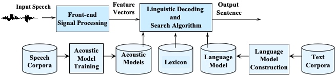
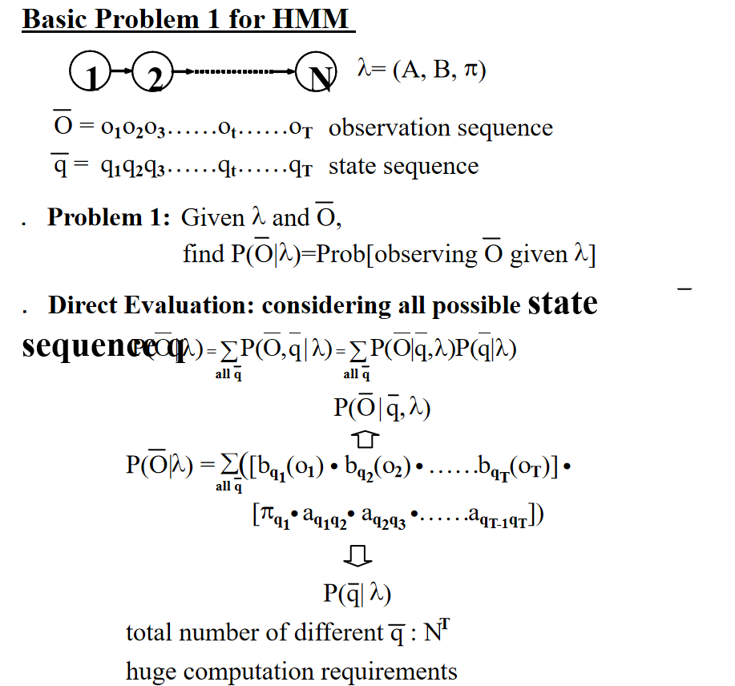
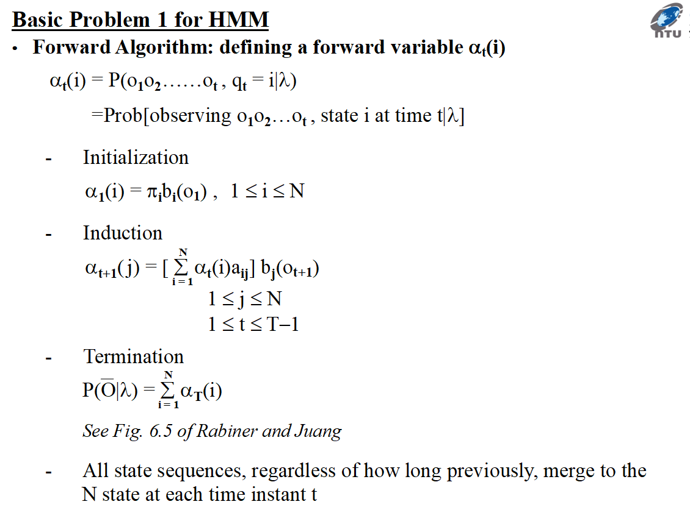
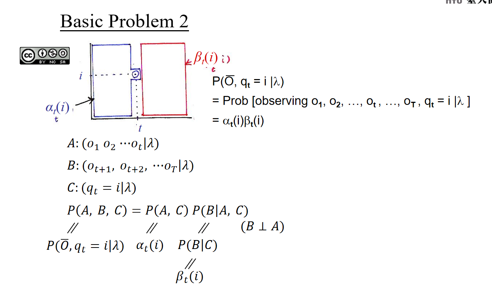
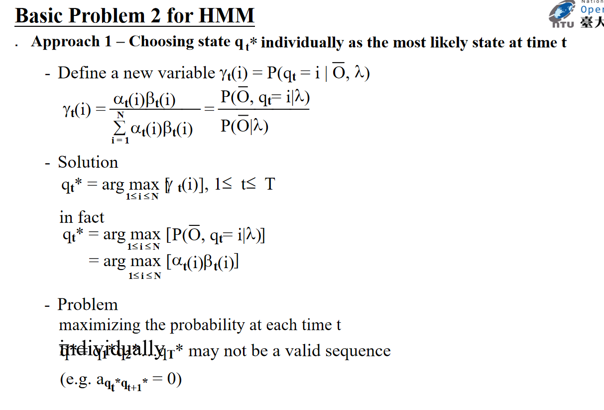
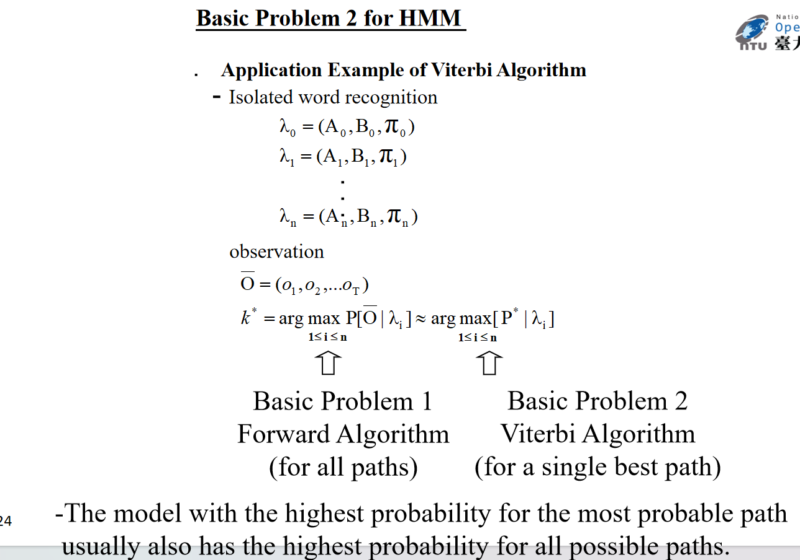
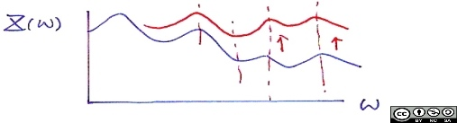

# 简介
这是台大的李琳山老师的课程，课程前八节是基础，后八节课是拓展。

# PartI: Fundamental Topics
## 1.0 Introduction to Digital Speech Processing

Acoustic Models ：声学模型，语音波形->语音单位（比如音素）

Lexicon：词典，语音单位->语言单位（比如字，或者单词或者词语）

Language Model：语言模型，比如预测在前一个语言单位下后一个语言单位的概率
## 2.0 Fundamentals of Speech Recognition
### HMM
定义如下：

### N-dim Guassion
### Feature Extraction (Front-end Signal Processing)
#### Pre-emphasis

#### Endpoint Detection (Speech/Silence Discrimination)

#### Windowing

Rectangular window

Hamming window
#### MFCC

#### N-gram
#### MAP(最大后验概率)
## 3.0 Map of Subject Areas
## 4.0 More about Hidden Markov Models
## 5.0 Acoustic Modeling
## 6.0 Language Modeling
## 7.0 Speech Signals and Front-end Processing
## 8.0 Search Algorithms for Speech Recognition
# Part II: Advanced Topics
## 9.0 Speech Recognition Updates
## 10.0 Speech-based Information Retrieval
## 11.0 Spoken Document Understanding and Organization for User-content Interaction
## 12.0 Computer-assisted Language Learning(Call)
## 13.0 Speaker Variabilities: Adaption and Recognition
## 14.0 Latent Topic Analysis
## 15.0 Robustness for Acoustic Environment
## 16.0 Some Fundamental Problem-solving Approaches
## 17.0 Spoken Dialogues
## 18.0 Conclusion

语者识别与适应
SI 语者独立
SD 语者相关
SA 语者适应
MAP 最大后验概率
MLLR 最大概率线性压缩
PCA 主成分分析
EigenVoice (PAC)
SAT
CAT