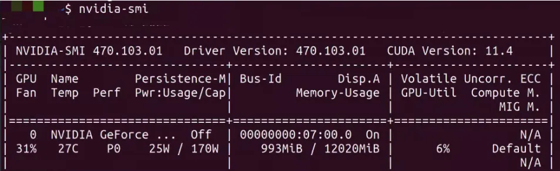
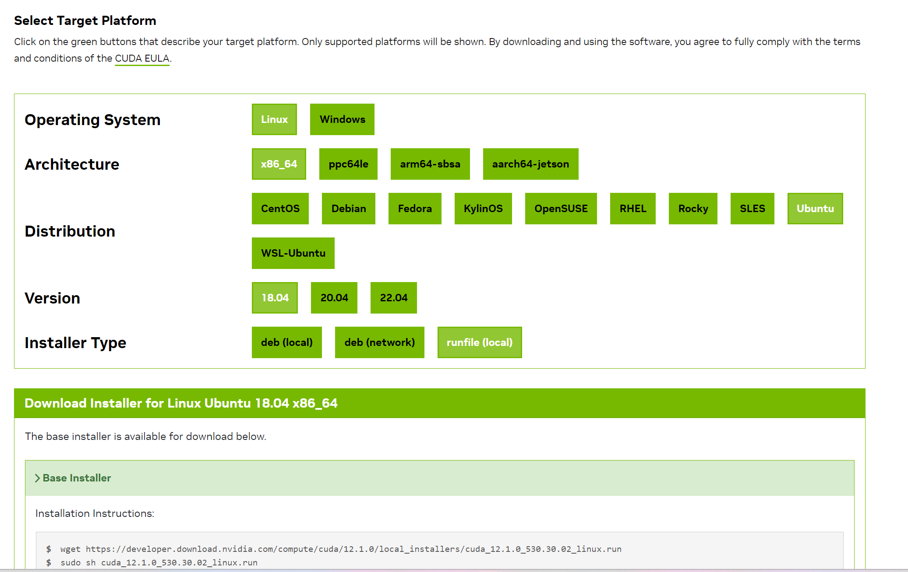

#
[官方文档](https://docs.nvidia.com/cuda/cuda-installation-guide-linux/index.html#)
[图文并茂讲解CUDA, CUDA Toolkit, CUDA Driver, CUDA Runtime, nvcc之间的关系及其版本兼容性](https://zhuanlan.zhihu.com/p/683431637)
# Nvidia显卡驱动一栏

如果你需要通过Linux上的Nvidia显卡来跑深度学习相关的任务，你需要安装下面的三个东西
- nvidia-driver:显卡驱动
- cuda-toolkit:cuda工具，也就是库
- torch:深度学习框架
下面是相关的东西
- nvcc:编译工具
- nvidia-smi:显卡管理工具

## 安装显卡驱动

安装显卡驱动需要和系统内核版本相互匹配,你可以通过下面的命令查看当前系统推荐的驱动，当然你也可以通过[官网](https://www.nvidia.com/en-us/geforce/drivers/)查看适合的驱动
```
ubuntu-drivers devices
```
可以通过下面的命令安装需要的驱动(注意如果有旧的驱动需要先卸载)
```
sudo ubuntu-drivers autoinstall #自动安装
sudo apt install nvidia-<driver number> #安装特定
```
注意：安装后会自动生成新的/boot/initrd.img

## 安装cudatoolkit
cudatoolkit的版本要小于显卡支持的最高版本，注意下面显示的是支持的cudatoolkit的最高版本
```
nvidia-smi # 查看当前显卡信息
```



### apt安装
可以通过apt安装，不过apt可能没有你想要的新版本cudatoolkit
```
sudo apt list *cuda-toolkit*
sudo apt install
```
### 官网安装
进入[官网](https://developer.nvidia.com/cuda-toolkit-archive)，选择适合你驱动的cudatoolkit，有三种安装方式
- 下载deb文件
- 网络安装
- 下载run文件


我选择的run文件，通过下面的方式安装,该方式只是安装cudatoolkit
```
sudo sh cuda_12.1.0_530.30.02_linux.run --toolkit --silence --override
```

实际上该脚本可以帮你完成驱动和cudatoolkit的一键安装,但是我已经安装了驱动，就不这样安装了，同时如果你安装了旧的驱动，他会提示你删掉旧驱动然后这个脚本帮你安装
```
sudo sh cuda_12.1.0_530.30.02_linux.run 
```

安装完后查看使用的cuda版本
```
nvcc -V
```

实际上cuda就是一个链接库,可以发现你当前的nvcc-V的版本和你的cuda链接的版本一致
```
ls /usr/local/
... bin  cuda  cuda-10.2  cuda-11.1  cuda-11.8  cuda-12.1  ...
```

## 卸载nvidia-dirver
以ubantu系统为例
```
sudo apt-get purge '*nvidia*'
sudo apt autoremove
sudo apt autoclean
```

## 卸载cudatoolkit
找到cuda文件夹内的卸载文件，比如/usr/local/cuda-11.1/bin/cuda-uninstaller(推荐)
```
sudo ./cuda-uninstaller
```
或者
```
sudo apt-get autoremove --purge cuda-11.1 
```
## 更换cudatoolkit

(1) 修改cuda文件链接
(2) 修改path:export PATH=/usr/local/cuda-11.1/bin:$PATH

